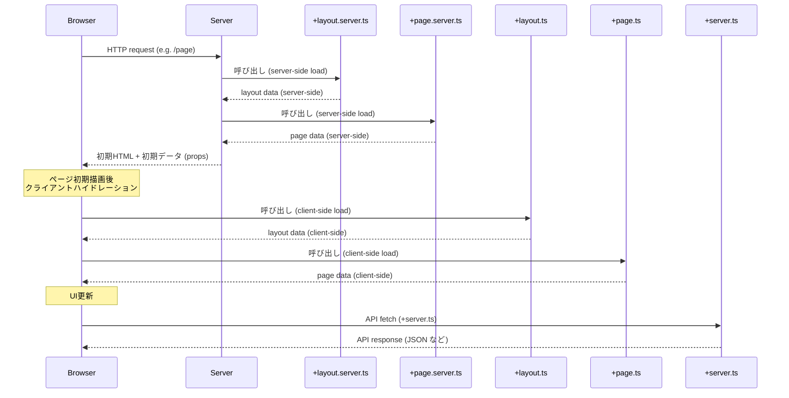

# SvelteKit チートシート（Basic）

## 1. プロジェクト作成

```bash
# SvelteKitプロジェクト作成
npx sv create myapp
cd myapp
npm install
npm run dev
```

デフォルトで`localhost:5173`でサーバーが起動します。

## 2. ファイル構造

```
my-app/
├── package-lock.json
├── package.json
├── README.md
├── src
│   ├── app.d.ts
│   ├── app.html            # HTMLテンプレート
│   ├── lib
│   │   └── index.ts
│   ├── routes/             # ルーティング用ディレクトリ
│   │   ├── +page.svelte    # ルートページ
│   │   ├── +page.js        # ページデータローディング
│   │   ├── +page.server.js # サーバーサイドローディング
│   │   ├── +layout.svelte  # ルートレイアウト
│   │   └── ...
│   ├── lib/                # 共有モジュール用
│   │   └── ...
│   └── ...
├── static                  # 静的ファイル
│   └── favicon.svg
├── svelte.config.js        # Svelte設定
├── tsconfig.json           # TypeScriptをJavaScriptにコンパイルするための設定ファイル
└── vite.config.ts          # Vite設定

```

## 3. ルーティング

SvelteKitはファイルシステムベースのルーティングを使用します。

### 基本的なルート

```
src/routes/
├── +page.svelte           # ルートページ (/)
├── about/
│   └── +page.svelte       # /about ページ
└── blog/
    ├── +page.svelte       # /blog ページ
    └── [slug]/            # 動的パラメータ
        └── +page.svelte   # /blog/:slug ページ
```

### ルートファイル

* `+page.svelte` — ページコンポーネント
* `+page.ts` — クライアントサイドのデータローディング（`load` 関数の型を付与）
* `+page.server.ts` — サーバーサイドのデータローディング
* `+layout.svelte` — レイアウトコンポーネント
* `+layout.ts` — レイアウトのデータローディング
* `+layout.server.ts` — サーバーサイドのレイアウトデータローディング
* `+error.svelte` — エラーページ（ここも `lang="ts"` を忘れずに）
* `+server.ts` — APIエンドポイント


### 動的ルートパラメータ

```
src/routes/blog/[slug]/+page.svelte
```

```svelte
<script>
  // paramsはデータローディング関数から取得
  export let data;
</script>

<h1>{data.title}</h1>
<div>{data.content}</div>
```

```javascript
// src/routes/blog/[slug]/+page.js
export function load({ params }) {
  return {
    slug: params.slug,
    title: `記事: ${params.slug}`,
    content: '...'
  };
}
```

### ルートグループ

```
src/routes/
├── (auth)/               # グループ名 (URLには影響しない)
│   ├── login/
│   │   └── +page.svelte  # /login
│   └── register/
│       └── +page.svelte  # /register
└── +layout.svelte        # 共通レイアウト
```

## SvelteKit の TypeScript 化された主要ファイルのテンプレート例
（SvelteKit 公式 `https://svelte.dev/docs/llms` をベースに最新仕様に準拠）


### 1️⃣ `+page.svelte`

```svelte
<script lang="ts">
  export let data: {
    message: string;
  };
</script>

<h1>{data.message}</h1>
```


### 2️⃣ `+page.ts`

```ts
import type { PageLoad } from './$types';

export const load: PageLoad = async ({ fetch }) => {
  const res = await fetch('/api/message');
  const { message } = await res.json();

  return {
    message
  };
};
```

### 3️⃣ `+page.server.ts`

```ts
import type { PageServerLoad } from './$types';

export const load: PageServerLoad = async ({ params }) => {
  const message = `Hello from server (params: ${params.id ?? 'none'})`;

  return {
    message
  };
};
```

### 4️⃣ `+layout.svelte`

```svelte
<script lang="ts">
  export let data: {
    user: { name: string };
  };
</script>

<header>Welcome, {data.user.name}</header>

<slot />
```


### 5️⃣ `+layout.ts`

```ts
import type { LayoutLoad } from './$types';

export const load: LayoutLoad = async () => {
  return {
    user: { name: 'Client User' }
  };
};
```

### 6️⃣ `+layout.server.ts`

```ts
import type { LayoutServerLoad } from './$types';

export const load: LayoutServerLoad = async ({ locals }) => {
  const user = locals.user ?? { name: 'Guest' };

  return {
    user
  };
};
```


### 7️⃣ `+error.svelte`

```svelte
<script lang="ts">
  export let error: Error;
  export let status: number;
</script>

<h1>{status}</h1>
<pre>{error.message}</pre>
```

### 8️⃣ `+server.ts` （API エンドポイント）

```ts
import type { RequestHandler } from './$types';
import { json } from '@sveltejs/kit';

export const GET: RequestHandler = async () => {
  return json({ message: 'Hello from API!' });
};

export const POST: RequestHandler = async ({ request }) => {
  const body = await request.json();
  return json({ received: body });
};
```

✅ **補足ポイント**

* `./$types` は SvelteKit により自動生成される型定義。
  `PageLoad`, `PageServerLoad`, `LayoutLoad`, `LayoutServerLoad`, `RequestHandler` を正しく型付けできる。
* `.svelte` ファイルでは **`lang="ts"` が必須**。
* API ハンドラでは `json()` ヘルパーを使うのが便利。


## SvelteKit データロードの基本的な流れ（例: ページ初期表示時）


### 説明：

✅ **重要なポイント**

* 初回リクエストは **サーバー側** の `+layout.server.ts` → `+page.server.ts` が順に呼ばれる。
* HTML と一緒に **初期データが `props` としてブラウザへ送られる**。
* その後、クライアント側で `+layout.ts` と `+page.ts` が呼ばれ、必要なら再フェッチ。
* `+server.ts` は **APIリクエスト専用のエンドポイント** で `fetch` 経由でアクセス。


## 4. データローディング

### ページデータローディング

```javascript
// src/routes/blog/+page.js
export function load({ fetch, params, url }) {
  // ブラウザとサーバーの両方で実行される

  return {
    posts: fetch('/api/posts').then(r => r.json())
  };
}
```

### サーバーサイドローディング

```javascript
// src/routes/blog/+page.server.js
import { error } from '@sveltejs/kit';
import * as db from '$lib/server/database';

export async function load({ params, locals, cookies }) {
  // サーバーサイドでのみ実行
  try {
    const posts = await db.getPosts();
    
    return { 
      posts
    };
  } catch (e) {
    throw error(500, 'データ取得に失敗しました');
  }
}
```

### レイアウトデータローディング

```javascript
// src/routes/+layout.js
export function load() {
  return {
    user: fetch('/api/user').then(r => r.json())
  };
}
```

```svelte
<!-- src/routes/+layout.svelte -->
<script>
  export let data;
  
  // data.user が利用可能
</script>

<nav>
  {#if data.user}
    <span>こんにちは、{data.user.name}さん</span>
  {:else}
    <a href="/login">ログイン</a>
  {/if}
</nav>

<main>
  <slot></slot>
</main>
```

### ネストしたデータ

```javascript
// src/routes/+layout.js
export function load() {
  return {
    theme: 'light'
  };
}

// src/routes/blog/+layout.js
export function load({ parent }) {
  // 親レイアウトのデータを取得
  return parent().then(parentData => {
    return {
      // 親データをマージ
      ...parentData,
      // 追加データ
      posts: fetch('/api/posts').then(r => r.json())
    };
  });
}
```

## 5. ヘッダーとクッキー

### ヘッダー設定

```javascript
// src/routes/api/data/+server.js
export function GET() {
  return new Response(JSON.stringify({ message: 'データ' }), {
    headers: {
      'Content-Type': 'application/json',
      'Cache-Control': 'max-age=3600'
    }
  });
}
```

### クッキーの読み書き

```javascript
// src/routes/login/+page.server.js
export const actions = {
  default: async ({ cookies, request }) => {
    const formData = await request.formData();
    const username = formData.get('username');
    
    // クッキーを設定
    cookies.set('username', username, {
      path: '/',
      httpOnly: true,
      maxAge: 60 * 60 * 24 * 7, // 1週間
      sameSite: 'strict'
    });
    
    return { success: true };
  }
};

// src/routes/profile/+page.server.js
export function load({ cookies }) {
  // クッキーを読み込み
  const username = cookies.get('username');
  
  if (!username) {
    throw redirect(302, '/login');
  }
  
  return { username };
}
```

## 6. 共有モジュール

### $libエイリアス

```javascript
// どのファイルからでも $lib パスを使って共有モジュールにアクセス可能
import { formatDate } from '$lib/utils';
import db from '$lib/server/database';
```

設定例:

```javascript
// svelte.config.js
import adapter from '@sveltejs/adapter-auto';
import { vitePreprocess } from '@sveltejs/vite-plugin-svelte';

/** @type {import('@sveltejs/kit').Config} */
const config = {
  preprocess: vitePreprocess(),
  kit: {
    adapter: adapter(),
    alias: {
      $components: './src/lib/components',
      $utils: './src/lib/utils'
    }
  }
};

export default config;
```

## 7. APIルート

### GETハンドラー

```javascript
// src/routes/api/posts/+server.js
import { json } from '@sveltejs/kit';

export async function GET({ url, params }) {
  const limit = Number(url.searchParams.get('limit') || '10');
  const posts = await fetchPosts(limit);
  
  return json(posts);
}
```

### POSTハンドラー

```javascript
// src/routes/api/posts/+server.js
import { json } from '@sveltejs/kit';

export async function POST({ request }) {
  const data = await request.json();
  
  // データ検証
  if (!data.title || !data.content) {
    return new Response(JSON.stringify({ error: '無効なデータ' }), {
      status: 400,
      headers: {
        'Content-Type': 'application/json'
      }
    });
  }
  
  const post = await createPost(data);
  
  return json(post, { status: 201 });
}
```

### その他のHTTPメソッド

```javascript
// src/routes/api/posts/[id]/+server.js
import { json } from '@sveltejs/kit';

export async function PUT({ params, request }) {
  const { id } = params;
  const data = await request.json();
  
  const updated = await updatePost(id, data);
  
  return json(updated);
}

export async function DELETE({ params }) {
  const { id } = params;
  
  await deletePost(id);
  
  return new Response(null, { status: 204 });
}
```

## 8. $app/state

### page

```svelte
<script>
  import { page } from '$app/state';
</script>

<p>現在のURL: {$page.url}</p>
<p>パスパラメータ: {JSON.stringify($page.params)}</p>
<p>クエリパラメータ: {$page.url.searchParams.get('q')}</p>

<!-- エラーページでは -->
<p>エラーステータス: {$page.status}</p>
<p>エラーメッセージ: {$page.error?.message}</p>
```

### navigating

```svelte
<script>
  import { navigating } from '$app/state';
</script>

{#if $navigating}
  <div class="loading">ページ読み込み中...</div>
{/if}
```

### updated

```svelte
<script>
  import { updated } from '$app/state';
</script>

{#if $updated}
  <div class="toast">
    新しいバージョンが利用可能です
    <button onclick={() => location.reload()}>更新</button>
  </div>
{/if}
```

## 9. エラーとリダイレクト

### エラー処理

```javascript
// src/routes/protected/+page.server.js
import { error } from '@sveltejs/kit';

export function load({ locals }) {
  if (!locals.user) {
    throw error(401, 'ログインが必要です');
  }
  
  return { message: '保護されたコンテンツ' };
}
```

### カスタムエラーページ

```svelte
<!-- src/routes/+error.svelte -->
<script>
  import { page } from '$app/state';
</script>

<h1>{$page.status}: {$page.error.message}</h1>

{#if $page.status === 404}
  <p>ページが見つかりません</p>
{:else}
  <p>エラーが発生しました</p>
{/if}
```

### リダイレクト

```javascript
// src/routes/old-page/+page.server.js
import { redirect } from '@sveltejs/kit';

export function load() {
  throw redirect(301, '/new-page');
}

// もしくはフォームアクション内
export const actions = {
  default: async ({ request }) => {
    // 処理後リダイレクト
    throw redirect(303, '/thank-you');
  }
};
```
