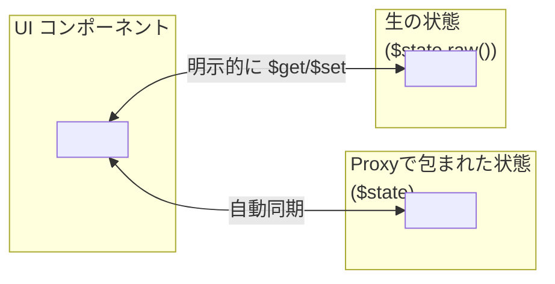

# `$state.raw()` vs `$state()` の違いと使い分け

Svelte 5 における `$state()` と `$state.raw()` は、どちらもリアクティブな状態管理を行うための仕組みですが、内部動作やユースケースに明確な違いがあります。

このドキュメントでは、それぞれの違いと使い分けのポイントをわかりやすく解説します。
  
## ✅ `$state()` とは？

`$state()` は、Svelte のリアクティブステートの基本構文です。これは、**内部で Proxy を用いて読み書きを監視する**ことにより、リアクティブなUI更新を実現します。

```svelte
<script>
  let count = $state(0);

  function increment() {
    count++;
  }
</script>

<p>Count: {count}</p>
<button onclick={increment}>+1</button>
```

* 直感的に書ける
* 変数の更新が自動的に UI に反映される
* `count++` や `array.push()` などの操作も検知される（Svelte 5では構造化された操作も追跡可能）
  
## 🔧 `$state.raw()` とは？

`$state.raw()` は、Proxy を経由せず、**生の状態オブジェクトを手動で管理するための低レベルAPI**です。リアクティブな更新を行うためには、明示的に `$get()` や `$set()` を使う必要があります。

```svelte
<script>
  let count = $state.raw(0);

  function increment() {
    $set(count, $get(count) + 1);
  }
</script>

<p>Count: {$get(count)}</p>
<button onclick={increment}>+1</button>
```

* `count` は Proxy ではなくプレーンな値参照
* `$get()` で取得し、`$set()` で更新する必要がある
* より **厳密な制御やトレース** を行いたい場合に使用
  
## 🆚 違いまとめ

| 項目      | `$state()`   | `$state.raw()`             |
| ------- | ------------ | -------------------------- |
| リアクティブ  | 自動（Proxy）    | 手動（`$get` / `$set`）        |
| 直感的な書き方 | 可能           | 不可（明示的な操作が必要）              |
| 適用例     | 通常のフォームや状態管理 | Map/Set、外部ライブラリ連携、デバッグ用途など |
| 内部処理    | Proxy による追跡  | 生値への直接アクセス                 |
  
## 🎯 いつ `$state.raw()` を使う？

以下のような場合に有効です。

* `Map`, `Set`, `Date`, `File` などの **特殊なネイティブ型** を扱うとき
* 外部ライブラリと状態を連携する際に、**変更検知の細かい制御**をしたいとき
* 自作のステート更新処理で、**どのタイミングで再描画させるかを明示的に制御**したいとき
* デバッグ目的で状態の取得・更新をログしたいとき
  

## 🖼️ 図解：状態管理の構造の違い



## 💡 使用例：Mapなどの特殊型

```svelte
<!-- ❌ $stateでMapを使うと更新がUIに反映されないことがある -->
<script>
  let myMap = $state(new Map());
  myMap.set('key', 'value'); // 再描画されない可能性
</script>

<!-- ✅ $state.rawを使う -->
<script>
  let myMap = $state.raw(new Map());

  function updateMap() {
    const map = $get(myMap);
    map.set('key', 'updated');
    $set(myMap, map); // 明示的に通知
  }
</script>

<button onclick={updateMap}>更新</button>
```

## 🔗 外部ライブラリと連携する場合

```svelte
<script>
  let chartData = $state.raw([]);

  function fetchDataFromLibrary() {
    const data = externalLibrary.getData(); // 外部で生成
    $set(chartData, data); // 手動で設定
  }
</script>

<ChartComponent data={$get(chartData)} />
```

## ✅ 結論

通常は `$state()` を使い、必要な場面でだけ `$state.raw()` を使うのがベストです。

> 高度な制御が必要な場面を除いては、`$state()` で完結するコードの方が簡潔かつ安全です。
