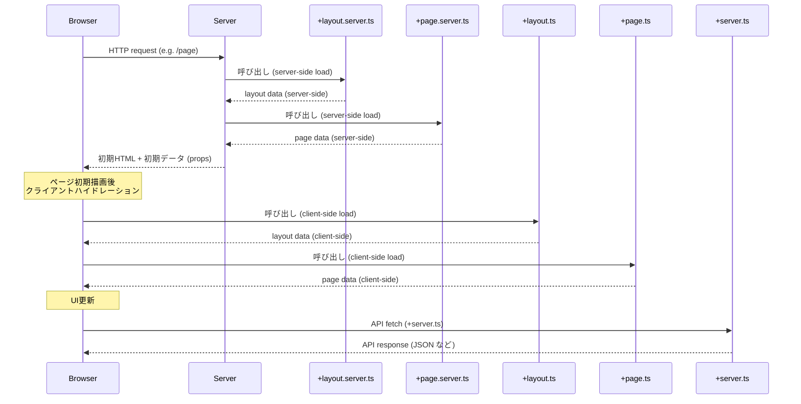

# SvelteKit データロードの基本的な流れ（例: ページ初期表示時）

SvelteKit の `+layout.ts` / `+layout.server.ts` / `+page.ts` / `+page.server.ts` と API (`+server.ts`) のデータフローをシーケンス図（Mermaid 形式）で表現してみましょう。

### 説明：

✅ **重要なポイント**

* 初回リクエストは **サーバー側** の `+layout.server.ts` → `+page.server.ts` が順に呼ばれる。
* HTML と一緒に **初期データが `props` としてブラウザへ送られる**。
* その後、クライアント側で `+layout.ts` と `+page.ts` が呼ばれ、必要なら再フェッチ。
* `+server.ts` は **APIリクエスト専用のエンドポイント** で `fetch` 経由でアクセス。

