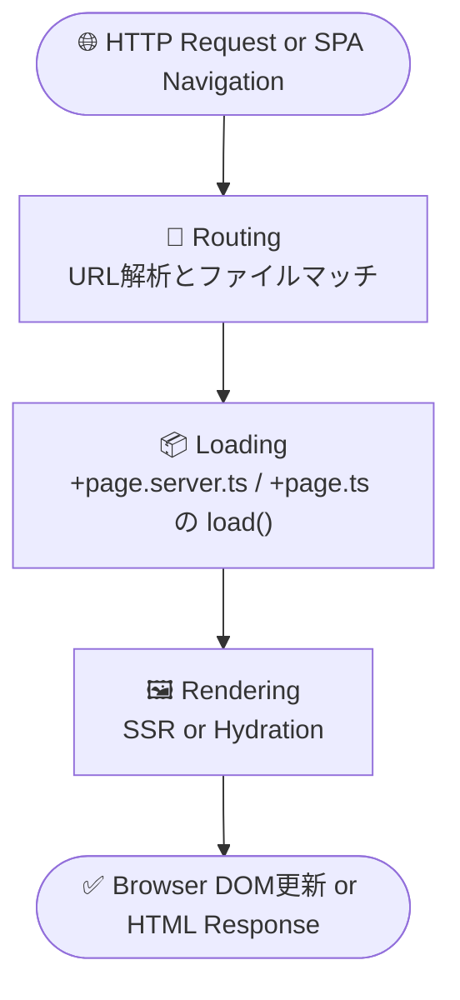
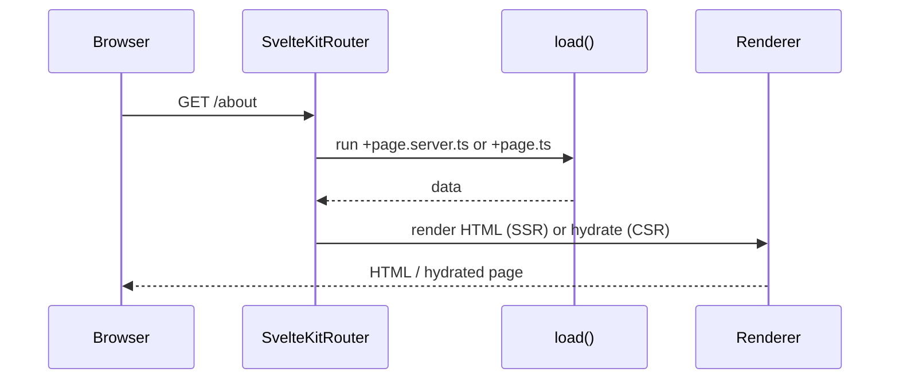
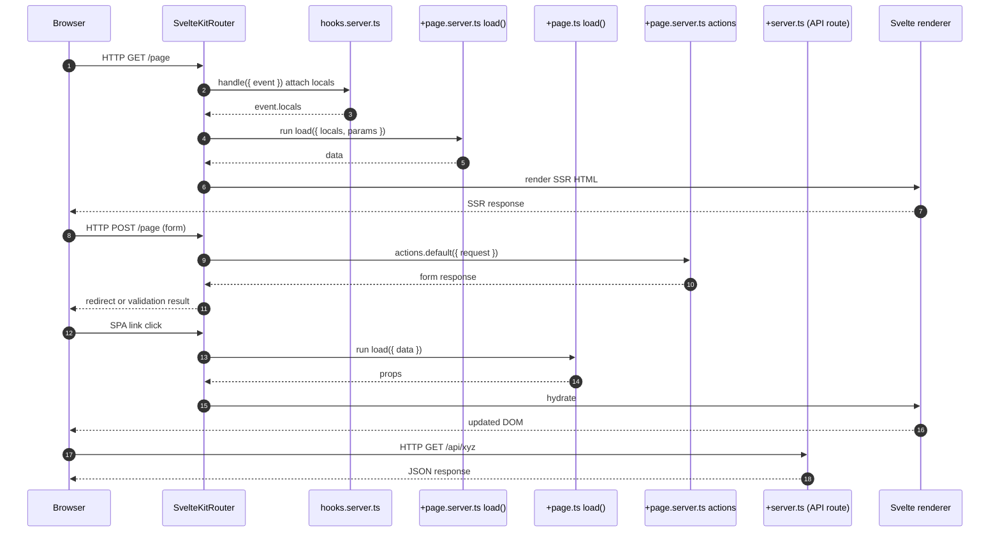

# SvelteKit が担う3つの責務：Routing / Loading / Rendering

SvelteKit のアプリケーション処理は、大きく以下の3つの責務に分類できます。

## 🧭 全体構造図

## 🔍 各責務の概要

| 責務 | 内容 | 対応ファイル | 実行タイミング |
|------|------|-------------|----------------|
| 🔀 Routing | ルート解決とファイルマッチング | `src/routes/**`（`+page.svelte`, `+layout.svelte` 等） | リクエスト開始時 |
| 📦 Loading | データ取得（`load()` 関数） | `+page.ts`, `+page.server.ts`, `+layout.ts` 等 | SSR時 または SPA遷移時 |
| 🖼 Rendering | 表示描画（HTML生成 or Hydration） | `+page.svelte`, `+layout.svelte` | SSRレスポンス生成 または クライアントでHydration |

## 💡 補足図：典型的な処理フロー

このように、Routing → Loading → Rendering は SvelteKit の基本処理サイクルであり、それぞれが独立しつつ連携しています。これにより柔軟な SSR / SPA 対応が可能になっています。

---

## 🧩 SvelteKit の統合処理マスターダイアグラム（Routing / Hooks / Load / Action / API）

以下は、SvelteKit アプリケーションがリクエストを受けてからレスポンスを返すまでに関与するすべての主要な仕組みを含んだ **全体処理の統合図** です。

---

この図は、以下のような SvelteKit の要素を統合的に示しています：

- 🔁 **Routing**: リクエストに応じてファイル構造と一致するルートを解決
- 🧩 **hooks.server.ts**: リクエストごとに `locals` を注入
- 🧠 **load() 関数**: ページ初期表示時のデータ取得（SSR/CSR）
- ✉️ **actions**: フォーム送信時のサーバ側処理
- 🔗 **+server.ts APIルート**: fetch() や外部通信として機能
- 🖼️ **Rendering**: SSRまたはHydrationを通じてHTMLを生成

これにより、SvelteKitの主要なリクエスト処理パイプライン全体を俯瞰できます。