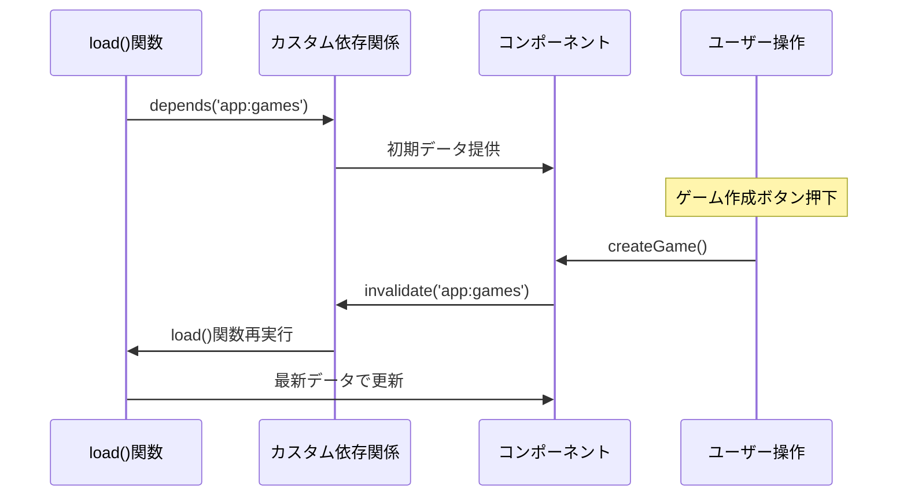

# SvelteKit `depends()` の完全解説

`depends()` は、SvelteKitでデータの**再取得タイミングを手動制御**するための強力な仕組みです。Angular の **RxJS Subject** や **BehaviorSubject** に近い概念で、特定の「依存関係」を登録して、後で無効化することでデータを再取得できます。

## 🎯 基本概念

### **従来の問題（Angular経験者向け）**
```typescript
// ❌ Angular での典型的な問題
@Component({...})
export class GameListComponent {
  games$ = this.http.get('/api/games');
  
  // 新しいゲームが作成されても、この一覧は自動更新されない
  // 手動でリロードが必要
}
```

### **SvelteKitでの解決方法**
```typescript
// ✅ SvelteKit depends() での解決
// src/routes/games/+page.js
export const load = async ({ fetch, depends }) => {
  // カスタム依存関係を登録
  depends('app:games');
  
  const games = await fetch('/api/games').then(r => r.json());
  return { games };
};
```

## 🔄 depends() と invalidate() の仕組み



## 📝 基本的な使い方

### **1. 依存関係の登録**
```typescript
// src/routes/games/+page.js
export const load = async ({ fetch, depends }) => {
  // カスタム依存関係を登録（任意の文字列）
  depends('app:games');        // ゲーム一覧
  depends('app:user-stats');   // ユーザー統計
  depends('game:live-data');   // ライブデータ
  
  const games = await fetch('/api/games').then(r => r.json());
  const stats = await fetch('/api/user/stats').then(r => r.json());
  
  return { games, stats };
};
```

### **2. 依存関係の無効化**
```svelte
<!-- src/routes/games/+page.svelte -->
<script>
  import { invalidate } from '$app/navigation';
  
  export let data;
  
  async function createGame() {
    const response = await fetch('/api/games', {
      method: 'POST',
      body: JSON.stringify({ title: 'New Game' })
    });
    
    if (response.ok) {
      // ゲーム一覧の依存関係を無効化 → load()再実行
      await invalidate('app:games');
    }
  }
  
  async function refreshStats() {
    // ユーザー統計のみ無効化
    await invalidate('app:user-stats');
  }
  
  async function refreshAll() {
    // すべての依存関係を無効化
    await invalidate();
  }
</script>

<button onclick={createGame}>新しいゲーム作成</button>
<button onclick={refreshStats}>統計更新</button>
<button onclick={refreshAll}>全データ更新</button>

{#each data.games as game}
  <div>{game.title}</div>
{/each}
```

depends() は以下のような場面で使うと 非常に適切で効果的 です：

## depends() を使うのが適切なケース一覧

ケース  内容  depends() を使う理由

|理由|説明|
|---|---|
|ページの一部を動的に更新したい|例：ユーザーのステータスや通知一覧など  ボタンなどで明示的に再取得させたいときに invalidate() が効くようにする
|同じ API を複数ページで共有している|例：ログインユーザー情報などが複数ページで必要  依存キーを統一し、invalidate('app:data:user') で全ページ更新可能にする|
|複数の load() 関数で同じデータを利用している|ayoutとpageの両方で user を使うなど  depends() を使うことで、再取得条件を一元化できる|
|バックグラウンドでの更新契機を作りたい|WebSocketなどのpush型更新が来た時に手動で更新したい  受信イベントで invalidate() を呼ぶことで、対象loadが再実行される|
|自作のストアとload結果を同期したい|ローカルステートとload結果の整合性を維持したいとき  ストアの更新タイミングで invalidate() すれば自動更新できる|


### 使用例
```ts
// +layout.ts
export async function load({ fetch, depends }) {
  depends('app:data:user');

  const res = await fetch('/api/user');
  const user = await res.json();

  return { user };
}
```
```svelte
<!-- 任意のコンポーネント -->
<script>
  import { invalidate } from '$app/navigation';

  function reloadUser() {
    invalidate('app:data:user');
  }
</script>

<button on:click={reloadUser}>ユーザー情報更新</button>
```

## 使わなくてもいいケース（逆に不要な場合）
- その load() 関数が URL パラメータやクエリで毎回変わる 場合（自動で再実行される）
- 単発のページでしか使わない fetch（他と連携がない場合）
- リアルタイム同期などが不要な静的ページ

## 補足

depends() で指定するキー（例: 'app:data:user'）は完全に 任意の文字列 です。設計ルールに従って名前を揃えるとチーム開発でも便利です。


## 🔄 Angular開発者への対応表

| Angular概念 | SvelteKit対応 | 説明 |
|------------|---------------|------|
| `Subject.next()` | `invalidate('key')` | 特定データの更新通知 |
| `BehaviorSubject` | `depends() + invalidate()` | 状態管理+更新 |
| `tap(操作)` | load関数内での処理 | データ取得時の副作用 |
| `switchMap` | load関数の再実行 | データソース切り替え |
| `shareReplay()` | SvelteKitの自動キャッシュ | データの共有 |

## 🎮 ジャンケンゲームでの実践例

### **ゲーム一覧ページ**
```typescript
// src/routes/+page.js
export const load = async ({ fetch, depends }) => {
  // 複数の依存関係を登録
  depends('app:games');          // ゲーム一覧
  depends('app:user-profile');   // ユーザープロフィール
  depends('app:notifications');  // 通知データ
  
  const [games, profile, notifications] = await Promise.all([
    fetch('/api/games').then(r => r.json()),
    fetch('/api/user/profile').then(r => r.json()),
    fetch('/api/notifications').then(r => r.json())
  ]);
  
  return { games, profile, notifications };
};
```

### **ゲーム作成・参加・更新**
```svelte
<!-- src/routes/+page.svelte -->
<script>
  import { invalidate } from '$app/navigation';
  import { page } from '$app/stores';
  
  export let data;
  
  // ゲーム作成
  async function createGame(formData) {
    const response = await fetch('/api/games', {
      method: 'POST',
      body: JSON.stringify({
        maxPlayers: formData.get('maxPlayers'),
        totalRounds: formData.get('totalRounds')
      })
    });
    
    if (response.ok) {
      // ゲーム一覧を更新
      await invalidate('app:games');
    }
  }
  
  // ゲーム参加
  async function joinGame(gameId) {
    const response = await fetch(`/api/games/${gameId}/join`, {
      method: 'POST',
      body: JSON.stringify({ playerName: 'プレイヤー1' })
    });
    
    if (response.ok) {
      // ゲーム一覧と通知を更新
      await invalidate('app:games');
      await invalidate('app:notifications');
    }
  }
  
  // プロフィール更新
  async function updateProfile() {
    const response = await fetch('/api/user/profile', {
      method: 'PUT',
      body: JSON.stringify({ displayName: '新しい名前' })
    });
    
    if (response.ok) {
      // プロフィールのみ更新
      await invalidate('app:user-profile');
    }
  }
</script>

<div class="dashboard">
  <section class="profile">
    <h2>プロフィール</h2>
    <p>名前: {data.profile.displayName}</p>
    <button onclick={updateProfile}>プロフィール更新</button>
  </section>
  
  <section class="notifications">
    <h2>通知 ({data.notifications.length})</h2>
    {#each data.notifications as notification}
      <div class="notification">{notification.message}</div>
    {/each}
  </section>
  
  <section class="games">
    <h2>ゲーム一覧</h2>
    <button onclick={() => createGame(new FormData())}>新しいゲーム作成</button>
    
    {#each data.games as game}
      <div class="game">
        <h3>{game.title}</h3>
        <p>参加者: {game.players.length}/{game.maxPlayers}</p>
        <button onclick={() => joinGame(game.id)}>参加</button>
      </div>
    {/each}
  </section>
</div>
```

### **リアルタイムゲームページ**
```typescript
// src/routes/game/[id]/+page.js
export const load = async ({ fetch, depends, params }) => {
  // ゲーム固有の依存関係
  depends(`game:${params.id}:state`);    // ゲーム状態
  depends(`game:${params.id}:players`);  // プレイヤー情報
  depends(`game:${params.id}:results`);  // 結果データ
  
  const game = await fetch(`/api/games/${params.id}`).then(r => r.json());
  return { game };
};
```

```svelte
<!-- src/routes/game/[id]/+page.svelte -->
<script>
  import { invalidate } from '$app/navigation';
  import { page } from '$app/stores';
  
  export let data;
  
  let socket;
  
  // WebSocket接続とリアルタイム更新
  onMount(() => {
    socket = new WebSocket(`wss://localhost:3000/game/${data.game.id}`);
    
    socket.onmessage = (event) => {
      const message = JSON.parse(event.data);
      
      switch (message.type) {
        case 'player_joined':
          // プレイヤー情報を更新
          invalidate(`game:${data.game.id}:players`);
          break;
          
        case 'game_state_changed':
          // ゲーム状態を更新
          invalidate(`game:${data.game.id}:state`);
          break;
          
        case 'round_completed':
          // 結果データを更新
          invalidate(`game:${data.game.id}:results`);
          break;
      }
    };
  });
  
  // ジャンケン選択送信
  async function submitChoice(choice) {
    socket.send(JSON.stringify({
      type: 'submit_choice',
      choice
    }));
    
    // 即座にUI更新（楽観的更新）
    await invalidate(`game:${data.game.id}:state`);
  }
</script>

<div class="game-room">
  <h1>ゲーム: {data.game.title}</h1>
  
  <!-- プレイヤー一覧 -->
  <div class="players">
    {#each data.game.players as player}
      <div class="player">
        {player.name} - 勝利数: {player.wins}
      </div>
    {/each}
  </div>
  
  <!-- ゲーム操作 -->
  {#if data.game.status === 'playing'}
    <div class="choices">
      <button onclick={() => submitChoice('rock')}>✊ グー</button>
      <button onclick={() => submitChoice('paper')}>✋ パー</button>
      <button onclick={() => submitChoice('scissors')}>✌️ チョキ</button>
    </div>
  {/if}
</div>
```

## 🔧 高度な使い方

### **条件付き依存関係**
```typescript
// src/routes/admin/+page.js
export const load = async ({ fetch, depends, locals }) => {
  // 管理者のみ特定の依存関係を登録
  if (locals.user?.role === 'admin') {
    depends('admin:all-games');
    depends('admin:user-management');
  } else {
    depends('app:games');
  }
  
  const data = locals.user?.role === 'admin' 
    ? await fetch('/api/admin/dashboard').then(r => r.json())
    : await fetch('/api/user/dashboard').then(r => r.json());
    
  return data;
};
```

### **階層的な依存関係**
```typescript
// 親レイアウトでの依存関係
// src/routes/game/+layout.js
export const load = async ({ depends }) => {
  depends('app:user-session');  // 全ゲームページ共通
  // ...
};

// 子ページでの依存関係
// src/routes/game/[id]/+page.js  
export const load = async ({ depends, params }) => {
  depends('app:user-session');     // 親と同じ（冗長だが明示的）
  depends(`game:${params.id}`);    // このゲーム固有
  // ...
};
```

### **invalidate() のタイミング制御**
```svelte
<script>
  import { invalidate } from '$app/navigation';
  import { debounce } from 'lodash';
  
  // デバウンス付き更新（連続クリック防止）
  const debouncedRefresh = debounce(async () => {
    await invalidate('app:games');
  }, 300);
  
  // 定期的な更新
  onMount(() => {
    const interval = setInterval(() => {
      invalidate('app:live-data');
    }, 5000); // 5秒ごと
    
    return () => clearInterval(interval);
  });
</script>
```

## ⚡ パフォーマンス最適化

### **部分的な更新**
```typescript
// ❌ 非効率：すべてのデータを再取得
await invalidate();

// ✅ 効率的：必要な部分のみ更新
await invalidate('app:games');        // ゲーム一覧のみ
await invalidate('app:notifications'); // 通知のみ
```

### **バッチ更新**
```typescript
// 複数の更新を一度に実行
await Promise.all([
  invalidate('app:games'),
  invalidate('app:user-stats'),
  invalidate('app:notifications')
]);
```

## 🎯 まとめ：depends() の威力

### **Angularとの比較**
| 用途 | Angular | SvelteKit depends() |
|------|---------|-------------------|
| データ更新 | Subject.next() | invalidate() |
| 状態管理 | Store + Actions | depends() + invalidate() |
| リアルタイム更新 | WebSocket + RxJS | WebSocket + invalidate() |
| キャッシュ無効化 | HTTP Interceptor | depends() システム |

### **depends() の利点**
- ✅ **宣言的**: どのデータが「依存」しているかが明確
- ✅ **選択的更新**: 必要な部分のみ再取得
- ✅ **型安全**: TypeScriptとの統合
- ✅ **パフォーマンス**: 不要な通信を回避
- ✅ **リアルタイム**: WebSocketとの組み合わせが簡単

**`depends()` は、SvelteKitの「リアクティブデータ管理」の核心機能です。Angular の RxJS に慣れた開発者なら、より直感的で強力な仕組みだと感じるはずです！**