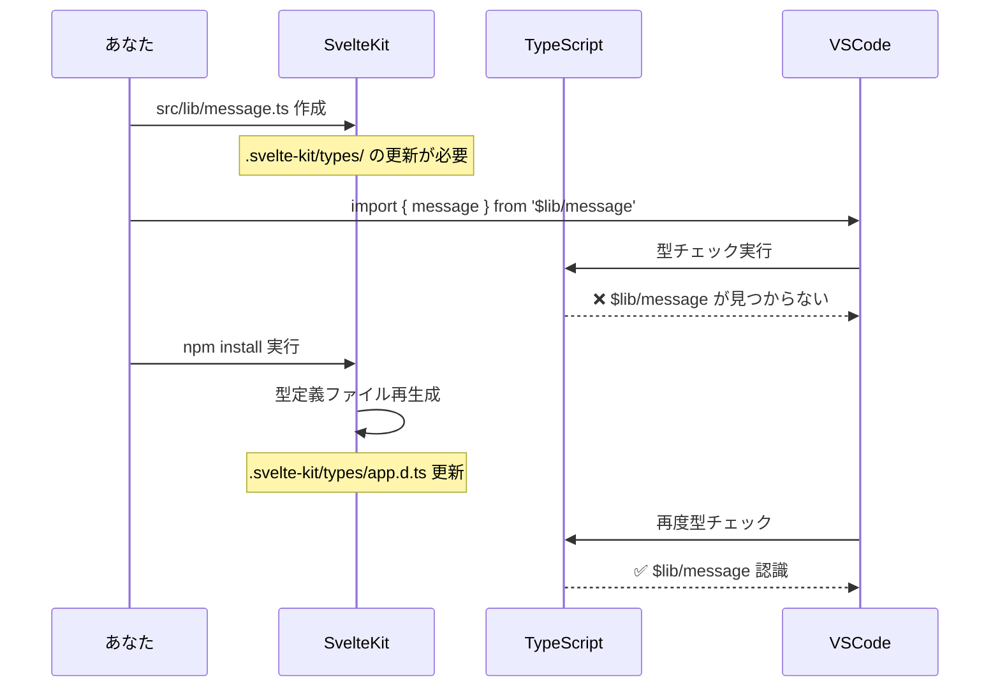

# `Cannot find module '$lib/*' or its corresponding type declarations.js(2307)`のメッセージが出たら。

## 事象
SvelteKitチュートリアルで[`$lib`](https://svelte.jp/tutorial/kit/lib)エイリアスの使い方をローカル環境で行った際に以下の事象が発生しました。

```svelte
<script>
  import { message } from '$lib/message';
</script>

<h1>home</h1>
<p>{message}</p>
```
```ts
// src/lib/message.ts
export const message = 'hello from $lib/message';
```

```
Cannot find module '$lib/message' or its corresponding type declarations.js(2307)
```
 という、エラーが出たが　`npm install`しなおしたら直った。

## 🔍 **エラーの原因**

### **TypeScript型定義の再生成が必要だった**

SvelteKitでは、プロジェクト構造（特に`$lib`等のパスエイリアス）が変更されると、TypeScriptの型定義ファイルを再生成する必要があります。

## 📁 **実際に何が起こったか**



## 🛠️ **具体的な解決方法（複数あり）**

### **方法1: `npm install`（あなたが使った方法）**
```bash
npm install
# 型定義ファイルが再生成される
```

### **方法2: `npm run dev` の再起動**
```bash
# 開発サーバーを停止
Ctrl + C

# 再起動
npm run dev
```

### **方法3: SvelteKit同期コマンド**
```bash
npm run dev -- --reload
# または
npx svelte-kit sync
```

### **方法4: VSCodeのTypeScript再起動**
```
Ctrl + Shift + P → "TypeScript: Restart TS Server"
```

## 📂 **何が再生成されるか**

### **隠れているファイル構造**
```
.svelte-kit/
├── generated/
│   ├── client/
│   └── server/
└── types/
    ├── app.d.ts          # ← ここに $lib の型定義
    ├── src/
    │   └── routes/
    └── ambient.d.ts
```

### **app.d.ts の中身（例）**
```typescript
// .svelte-kit/types/app.d.ts（自動生成）
declare global {
  const $lib: typeof import('../src/lib/index.js');
}

// パスマッピング定義
declare module '$lib/*' {
  const value: any;
  export = value;
}
```

## 🎯 **Angular開発者との比較**

| Angular | SvelteKit | 解決方法 |
|---------|-----------|----------|
| `ng build` で型エラー | `npm install` で型再生成 | 開発サーバー再起動 |
| `tsconfig.json` 手動更新 | 自動生成される | `svelte-kit sync` |
| `@types/*` パッケージ追加 | 不要（自動生成） | - |

## 🔧 **今後の予防策**

### **1. 新しい `$lib` ファイル作成時**
```typescript
// 1. ファイル作成
// src/lib/新しいファイル.ts

// 2. 必ず開発サーバー確認
// ターミナルで npm run dev が動いているか

// 3. エラーが出たら再起動
npm run dev
```

### **2. パッケージ追加時**
```bash
npm install 新しいパッケージ
# 自動的に型定義も更新される
```

### **3. VSCode設定（推奨）**
```json
// .vscode/settings.json
{
  "typescript.preferences.includePackageJsonAutoImports": "auto",
  "typescript.updateImportsOnFileMove.enabled": "always"
}
```

## 💡 **TypeScript + SvelteKit のベストプラクティス**

### **1. パスエイリアス使用時**
```typescript
// ✅ 推奨
import { message } from '$lib/message';
import type { GameRoom } from '$lib/types';

// ❌ 相対パス（長くなる）
import { message } from '../../../lib/message';
```

### **2. 型定義ファイルの場所**
```
src/lib/
├── types/           # 型定義専用
│   ├── game.ts      # ゲーム関連型
│   └── user.ts      # ユーザー関連型
├── stores/          # ストア
├── components/      # 共有コンポーネント
└── utils/           # ユーティリティ
```

### **3. 再エクスポートパターン**
```typescript
// src/lib/index.ts
export { message } from './message';
export type { GameRoom, Player } from './types/game';

// 使用側
import { message, type GameRoom } from '$lib';
```

## 🎮 **ジャンケンゲームでの活用例**

```ts
// src/lib/types/game.ts
export interface Player {
  id: string;
  name: string;
  choice?: 'rock' | 'paper' | 'scissors';
  isReady: boolean;
  wins: number;
}

export interface GameRoom {
  id: string;
  maxPlayers: number;
  totalRounds: number;
  players: Player[];
  status: 'waiting' | 'ready' | 'playing' | 'finished';
}

// src/lib/config.ts
export const GAME_CONFIG = {
  MAX_PLAYERS: 10,
  MAX_ROUNDS: 100,
  EXPIRY_DAYS: 5
} as const;

// src/lib/utils/game.ts
import type { Player } from '$lib/types/game';

export function determineWinner(choices: Record<string, 'rock' | 'paper' | 'scissors'>): string[] {
  // ジャンケン勝敗判定ロジック
  const playerIds = Object.keys(choices);
  // ... 実装
  return playerIds; // 勝者のID配列
}

// src/lib/stores/game.ts
import { writable } from 'svelte/store';
import type { GameRoom } from '$lib/types/game';

export const currentGame = writable<GameRoom | null>(null);

// src/lib/index.ts（再エクスポート）
export type { Player, GameRoom } from './types/game';
export { GAME_CONFIG } from './config';
export { determineWinner } from './utils/game';
export { currentGame } from './stores/game';
```

## 🚀 **まとめ**

### **エラーの本質**
TypeScriptが`$lib`パスエイリアスを認識するための型定義ファイルが、新しいファイル作成時に再生成されていなかった。

### **簡単な解決順序**
1. **開発サーバー再起動** （最も簡単）
2. **`npm install`** （確実）
3. **VSCode TypeScript再起動** （IDE問題の場合）

### **今後の習慣**
- `src/lib/` に新しいファイルを作ったら開発サーバーが生きているか確認
- エラーが出たらまず再起動

**これでチュートリアルを安心して進められますね！次はどの章を進めますか？** 🎯