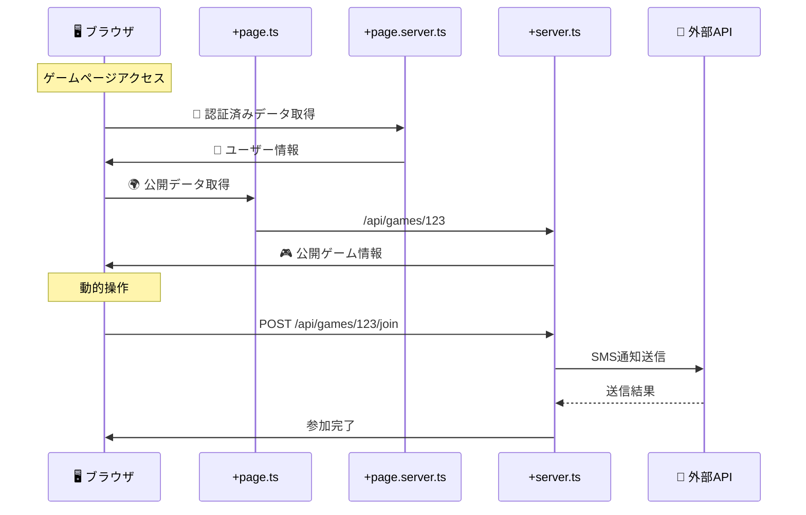

# ジャンケンゲームでの +server.ts 活用例

## 📁 ファイル構成と役割分担

```
src/routes/
├── game/[id]/
│   ├── +page.svelte          # 🖥️ ゲームUI
│   ├── +page.ts              # 🌍 公開ゲーム情報取得
│   ├── +page.server.ts       # 🔐 参加認証・プライベートデータ
│   └── +server.ts            # 🌐 ゲーム操作API
│
├── api/
│   ├── games/
│   │   ├── +server.ts        # 🌐 ゲーム一覧・作成API
│   │   └── [id]/
│   │       ├── +server.ts    # 🌐 ゲーム詳細・更新API
│   │       ├── join/
│   │       │   └── +server.ts # 🌐 参加処理API
│   │       └── play/
│   │           └── +server.ts # 🌐 選択送信API
│   │
│   ├── notifications/
│   │   └── +server.ts        # 🔐 招待メール/SMS送信
│   │
│   └── external/
│       └── sms/
│           └── +server.ts    # 🔐 外部SMS API橋渡し
```

## 🔄 データフロー図



## 💡 具体的な実装例

### 1. ゲーム参加ページ（初期表示）

#### `+page.server.ts` - 認証とプライベートデータ
```typescript
// 🔐 サーバーでのみ実行（秘密データ）
export const load = async ({ params, locals, cookies }) => {
  // 認証チェック
  if (!locals.user) {
    throw redirect(302, '/login');
  }
  
  // プライベートデータ取得
  const userGameHistory = await db.getUserGameHistory(locals.user.id);
  const gamePermissions = await db.getGamePermissions(params.id, locals.user.id);
  
  return {
    user: locals.user,
    gameHistory: userGameHistory,
    canJoin: gamePermissions.canJoin,
    isOwner: gamePermissions.isOwner
  };
};
```

#### `+page.ts` - 公開データ取得
```typescript
// 🌍 ユニバーサル実行（公開データ）
export const load = async ({ fetch, params }) => {
  // 公開ゲーム情報を取得（APIキー不要）
  const gameResponse = await fetch(`/api/games/${params.id}`);
  const game = await gameResponse.json();
  
  // ゲーム統計情報
  const statsResponse = await fetch(`/api/games/${params.id}/stats`);
  const stats = await statsResponse.json();
  
  return {
    game,
    stats,
    lastUpdated: new Date().toISOString()
  };
};
```

### 2. API エンドポイント（動的操作）

#### `src/routes/api/games/[id]/+server.ts` - 公開ゲーム情報
```typescript
export async function GET({ params }) {
  // 🌍 誰でもアクセス可能な公開情報
  const game = await db.getPublicGameInfo(params.id);
  
  if (!game) {
    throw error(404, 'ゲームが見つかりません');
  }
  
  return json({
    id: game.id,
    title: game.title,
    players: game.players.map(p => ({
      name: p.name,
      isReady: p.isReady,
      wins: p.wins
    })),
    status: game.status,
    currentRound: game.currentRound,
    totalRounds: game.totalRounds
  });
}

export async function PUT({ params, request, locals }) {
  // 🔐 ゲーム更新（認証必要）
  if (!locals.user) {
    throw error(401, '認証が必要です');
  }
  
  const updates = await request.json();
  const updatedGame = await db.updateGame(params.id, updates, locals.user.id);
  
  return json(updatedGame);
}
```

#### `src/routes/api/games/[id]/join/+server.ts` - 参加処理
```typescript
export async function POST({ params, request, locals }) {
  const { playerName, notifyContacts } = await request.json();
  
  // ゲーム参加処理
  const result = await gameService.joinGame(params.id, {
    playerId: locals.user?.id,
    playerName,
    userAgent: request.headers.get('user-agent')
  });
  
  // 他の参加者への通知（外部API利用）
  if (notifyContacts && notifyContacts.length > 0) {
    await Promise.all(
      notifyContacts.map(contact => 
        fetch('/api/notifications/game-update', {
          method: 'POST',
          headers: { 'Content-Type': 'application/json' },
          body: JSON.stringify({
            gameId: params.id,
            contact,
            message: `${playerName}さんがゲームに参加しました！`
          })
        })
      )
    );
  }
  
  return json(result);
}
```

### 3. 外部API橋渡し（セキュリティ重要）

#### `src/routes/api/notifications/+server.ts` - 通知送信
```typescript
export async function POST({ request, locals }) {
  // 🔐 認証チェック
  if (!locals.user) {
    throw error(401, '認証が必要です');
  }
  
  const { type, recipient, message, gameId } = await request.json();
  
  try {
    switch (type) {
      case 'sms':
        // 🔐 外部SMS API（APIキー隠蔽）
        const smsResult = await fetch('https://api.twilio.com/2010-04-01/Accounts/[SID]/Messages.json', {
          method: 'POST',
          headers: {
            'Authorization': `Basic ${btoa(`${TWILIO_SID}:${TWILIO_TOKEN}`)}`
          },
          body: new URLSearchParams({
            To: recipient,
            From: SMS_FROM_NUMBER,
            Body: `${message}\n\nゲームURL: ${PUBLIC_BASE_URL}/game/${gameId}`
          })
        });
        
        return json({ success: true, provider: 'twilio' });
        
      case 'email':
        // 🔐 外部Email API（APIキー隠蔽）
        const emailResult = await fetch('https://api.sendgrid.com/v3/mail/send', {
          method: 'POST',
          headers: {
            'Authorization': `Bearer ${SENDGRID_API_KEY}`,
            'Content-Type': 'application/json'
          },
          body: JSON.stringify({
            personalizations: [{ to: [{ email: recipient }], subject: 'ジャンケンゲーム招待' }],
            from: { email: EMAIL_FROM_ADDRESS },
            content: [{ type: 'text/html', value: `
              <h2>ジャンケンゲームに招待されました！</h2>
              <p>${message}</p>
              <a href="${PUBLIC_BASE_URL}/game/${gameId}">ゲームに参加する</a>
            ` }]
          })
        });
        
        return json({ success: true, provider: 'sendgrid' });
    }
  } catch (error) {
    console.error('通知送信エラー:', error);
    throw error(500, '通知の送信に失敗しました');
  }
}
```

## 🎯 使い分けの判断基準

### ✅ `+page.ts` を使う場合
- ✅ 公開データの取得
- ✅ 外部APIへの直接アクセス（APIキー不要）
- ✅ SEO重要なデータ
- ✅ 初回表示で必要なデータ

### ✅ `+page.server.ts` を使う場合
- ✅ 認証が必要な初期データ
- ✅ ユーザー固有のデータ
- ✅ フォーム処理（actions）
- ✅ データベース直接アクセス

### ✅ `+server.ts` を使う場合
- ✅ **外部API橋渡し（APIキー隠蔽）** ⭐️
- ✅ **動的なCRUD操作**
- ✅ **リアルタイム更新用API**
- ✅ **モバイルアプリ等からのAPI利用**
- ✅ **Webhook受信**

## 🔄 実際のワークフロー例

### ジャンケンゲーム作成〜参加の流れ

1. **ゲーム作成画面**
   - `+page.ts`: ゲーム設定UI用のデータ
   - `+page.server.ts`: 作成者の認証・履歴
   - **`+server.ts`: ゲーム作成API**

2. **招待送信**
   - `+page.svelte`: 招待フォーム
   - **`/api/notifications/+server.ts`: SMS/Email送信（外部API橋渡し）**

3. **参加者がアクセス**
   - `+page.ts`: 公開ゲーム情報表示
   - `+page.server.ts`: 参加者の認証状態
   - **`/api/games/[id]/join/+server.ts`: 参加処理**

4. **ゲーム進行**
   - `+page.svelte`: WebSocket接続でリアルタイム通信
   - **`/api/games/[id]/play/+server.ts`: 選択送信・結果計算**

## 💡 Angular開発者への対応

| Angular | SvelteKit | 用途 |
|---------|-----------|------|
| HTTP Interceptor | `+server.ts` | 外部API橋渡し |
| Service + Injectable | `+server.ts` | API提供 |
| Guard + Resolver | `+page.server.ts` | 認証+初期データ |
| Component初期化 | `+page.ts` | 公開データ取得 |

## 🎯 まとめ

**`+server.ts`は外部API橋渡しで特に威力を発揮します！**

- 🔐 **APIキーの隠蔽**（セキュリティ）
- 🌍 **CORS問題の回避**
- 📊 **レスポンス加工・フィルタリング**
- ⚡ **レート制限の一元管理**

ユニバーサルデータ取得（`+page.ts`）と組み合わせることで、セキュアで効率的なデータフローを実現できます。