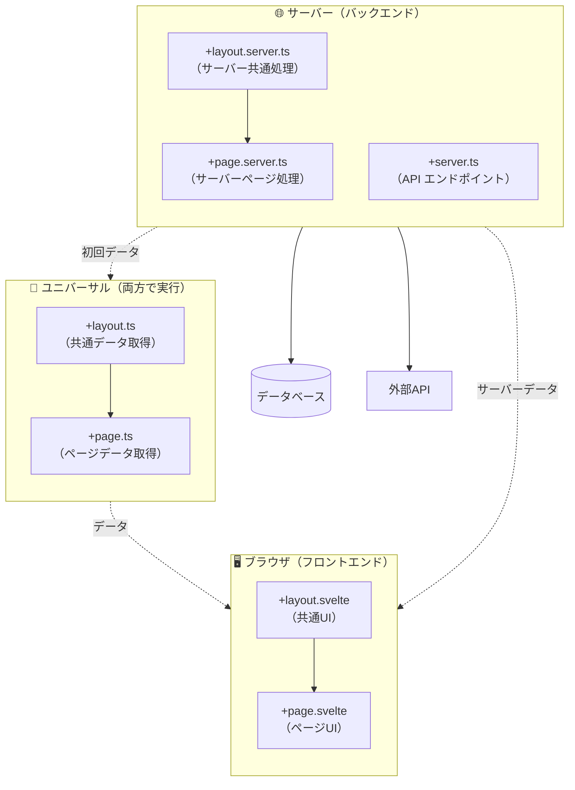
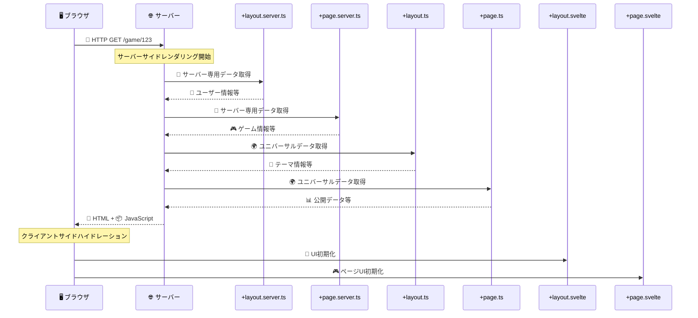
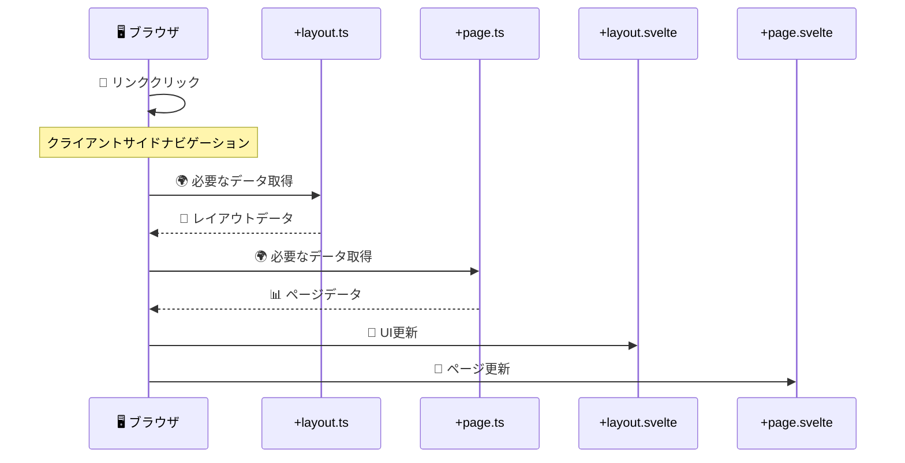

# SvelteKit ルーティング規則に基づくファイル

SvelteKit における「+がつくファイル」（通称：routing conventions に基づくファイル）は、主に以下の種類があります。それぞれが特定の役割を担っており、SvelteKitのルーティングやレンダリング、データロードの仕組みを支える要素です。

## 📁 一覧：`+` がつくファイルの種類（主要なもの）

|ファイル名|役割|実行環境|使用場所|
|---|---|---|---|
|`+page.svelte`|ページのUIを記述するコンポーネント|ブラウザ|各ルート|
|`+page.ts/js`|ユニバーサルロード関数（公開データ取得）|サーバー+ブラウザ|各ルート|
|`+page.server.ts/js`|サーバー専用ロード関数・アクション|サーバーのみ|各ルート|
|`+layout.svelte`|レイアウト（共通UI）の定義|ブラウザ|各階層ルート|
|`+layout.ts/js`|ユニバーサルレイアウトロード|サーバー+ブラウザ|各階層ルート|
|`+layout.server.ts/js`|サーバー専用レイアウトロード・アクション|サーバーのみ|各階層ルート|
|`+server.ts/js`|APIエンドポイント（GET, POST等）|サーバーのみ|各ルート|


##  補足的なファイル（フォームアクションやリダイレクトなど）

|ファイル名|用途例（補足）|
|---|---|
|`+error.svelte`|エラー表示ページ（レイアウトごとに設定可）|
|`+layout.reset.svelte`|レイアウトの継承をリセットしたい時|
|`+page.svelte` + `export const prerender = true;`|静的プリレンダー用ページ設定|
|`+page.ts` の `actions`|フォーム処理など（POST）に使う|


##  特別なディレクトリとの併用
- `src/routes/api/hello/+server.ts` などで API エンドポイントとして使用
- `src/routes/[slug]/+page.ts` のように動的パラメータと併用可

##  開発中に便利な考え方
- `+page.svelte`：何を表示するか
- `+page.ts` / +page.server.ts：どうデータを用意するか
- `+layout.*`：他のページでも共通して使うレイアウトやデータ
- `+server.ts`：APIとして振る舞わせるとき


## 🏗️ 実行環境別の理解（Angular開発者向け）

### 🖥️ ブラウザ実行（フロントエンド）
- `+page.svelte` → Angular の Component + Template
- `+layout.svelte` → Angular の app.component.html

### 🌐 サーバー実行（バックエンド）  
- `+page.server.ts` → .NET Web API Controller
- `+server.ts` → RESTful API エンドポイント

### 🔄 両方実行（ユニバーサル）
- `+page.ts` → データ取得処理（初回はサーバー、以降はブラウザ）
- `+layout.ts` → 共通データ取得処理

## 📊 ファイル構成の視覚化

### 🏗️ 実行環境別のアーキテクチャ図



### 🔄 実行タイミング別のシーケンス図

#### 初回アクセス時（SSR）


#### クライアント遷移時（SPA）


## 📋 実行環境別まとめ表

### 🖥️ ブラウザ実行ファイル
| ファイル | 役割 | Angular類似 | 備考 |
|---------|------|-------------|------|
| `+page.svelte` | ページUI | Component + Template | ユーザーインタラクション |
| `+layout.svelte` | 共通UI | app.component.html | ナビゲーション、フッター等 |

### 🌐 サーバー実行ファイル
| ファイル | 役割 | .NET類似 | 備考 |
|---------|------|----------|------|
| `+page.server.ts` | サーバー処理 | Web API Controller | 認証、DB直接アクセス |
| `+layout.server.ts` | サーバー共通処理 | Base Controller | 共通認証、共通データ |
| `+server.ts` | APIエンドポイント | API Controller | RESTful API |

### 🔄 ユニバーサル実行ファイル
| ファイル | 役割 | 特徴 | 備考 |
|---------|------|------|------|
| `+page.ts` | データ取得 | 初回：サーバー<br/>以降：ブラウザ | 公開データのみ |
| `+layout.ts` | 共通データ取得 | 初回：サーバー<br/>以降：ブラウザ | 共通公開データ |

## 🎯 実行タイミング別まとめ表

### 🚀 初回アクセス時（SSR）
| ファイル | サーバー実行 | ブラウザ実行 | データ取得 |
|---------|-------------|-------------|-----------|
| `+layout.server.ts` | ✅ | ❌ | 🔐 秘密データ |
| `+page.server.ts` | ✅ | ❌ | 🔐 秘密データ |
| `+layout.ts` | ✅ | ❌ | 🌍 公開データ |
| `+page.ts` | ✅ | ❌ | 🌍 公開データ |
| `+layout.svelte` | ✅ (SSR) | ✅ (Hydration) | - |
| `+page.svelte` | ✅ (SSR) | ✅ (Hydration) | - |

### 🔗 クライアント遷移時（SPA）
| ファイル | サーバー実行 | ブラウザ実行 | データ取得 |
|---------|-------------|-------------|-----------|
| `+layout.server.ts` | ❌ | ❌ | - |
| `+page.server.ts` | ❌ | ❌ | - |
| `+layout.ts` | ❌ | ✅ | 🌍 公開データ |
| `+page.ts` | ❌ | ✅ | 🌍 公開データ |
| `+layout.svelte` | ❌ | ✅ | - |
| `+page.svelte` | ❌ | ✅ | - |

### 区分別のまとめ表

| ファイル | ブラウザ側 | サーバ側 | 初回リクエスト | クライアント遷移 | 備考 |
|----|---|---|---|---|---|
| `+layout.svelte` | ✅ | | ✅ | ✅ | HTML構造（共通部） |
| `+layout.ts` | ✅ | ✅ | ✅ | ✅ | クライアントでも使える |
| `+layout.server.ts` | | ✅ | ✅ | ❌ | SSR時のみ |
| `+page.svelte` | ✅ | | ✅ | ✅ | ページ本体 |
| `+page.ts` | ✅ | ✅ | ✅ | ✅ | 両対応（isomorphic） |
| `+page.server.ts` | | ✅ | ✅ | ❌ | SSR時のみ |
| `+server.ts` | | ✅ | APIのみ | APIのみ | REST風APIエンドポイント |


## 🎮 ゲーム開発での具体例

### ジャンケンゲーム参加ページ（`/game/[id]`）
```
src/routes/game/[id]/
├── +page.svelte          # 🖥️ ゲームUI（選択ボタン、結果表示）
├── +page.ts              # 🌍 ゲーム公開情報取得
├── +page.server.ts       # 🔐 参加認証、プレイヤー情報
├── +layout.svelte        # 🖥️ ゲーム共通UI（ヘッダー、参加者一覧）
├── +layout.server.ts     # 🔐 ユーザー認証チェック
└── +server.ts            # 🌐 API（参加、選択送信）
```

### 各ファイルの役割
```typescript
// +page.server.ts - サーバー専用（認証必要）
export const load = async ({ params, locals }) => {
  // 🔐 ユーザー認証チェック
  if (!locals.user) throw redirect(302, '/login');
  
  // 🔐 データベース直接アクセス
  const game = await db.getGame(params.id);
  return { game, user: locals.user };
};

// +page.ts - ユニバーサル（公開データ）
export const load = async ({ fetch, params }) => {
  // 🌍 公開データ取得（APIアクセス）
  const publicGameInfo = await fetch(`/api/games/${params.id}/public`);
  return { publicInfo: await publicGameInfo.json() };
};

// +page.svelte - UI
<script>
  export let data; // サーバーとユニバーサルデータがマージされる
  
  // 🎮 ゲームUI
  let selectedChoice = null;
</script>

<!-- 🖥️ ブラウザで実行 -->
<div class="game-room">
  <h1>ゲーム: {data.game.title}</h1>
  <div class="players">
    {#each data.publicInfo.players as player}
      <div class="player">{player.name}</div>
    {/each}
  </div>
</div>

// +server.ts - API
export async function POST({ request, params }) {
  // 🌐 API エンドポイント
  const choice = await request.json();
  return json({ success: true });
}
```

## 🎓 Angular開発者への要点

### 🔄 概念の対応
- **Angular Guard** → `+layout.server.ts` での認証チェック
- **Angular Resolver** → `+page.ts` でのデータ事前取得
- **Angular Service** → `+server.ts` でのAPI提供
- **Angular Component** → `+page.svelte` でのUI定義

### 💡 重要な違い
1. **ファイルベースルーティング**: 設定ファイル不要、フォルダ構造がそのままルート
2. **サーバー統合**: 同一プロジェクトでフロント・バックエンド管理
3. **自動データマージ**: `.server.ts` と `.ts` のデータが自動統合

## 🔗 参考（公式ドキュメント）
- [SvelteKit Routing 公式ドキュメント](https://kit.svelte.dev/docs/routing)
- [SPA vs SvelteKit アーキテクチャ比較](./spa-vs-sveltekit-architecture.md)


