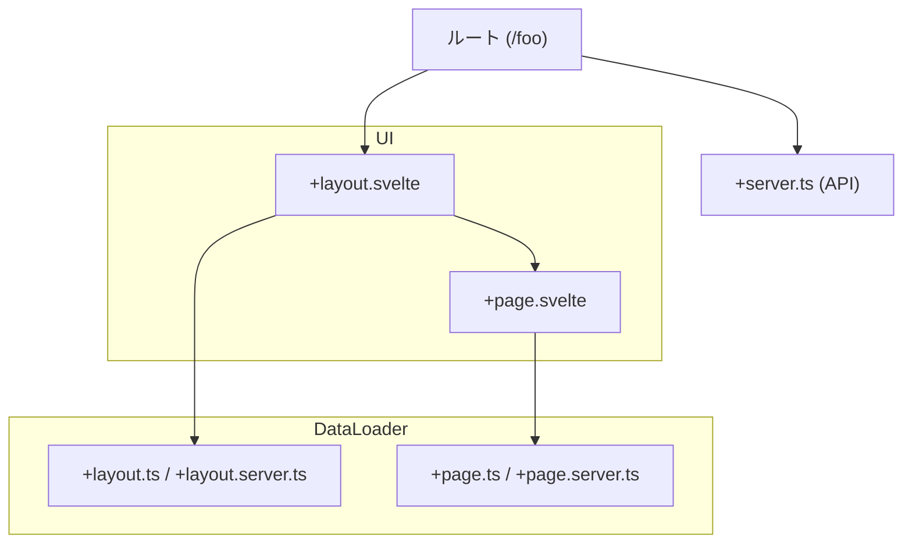
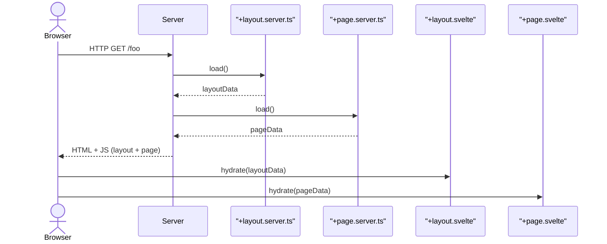
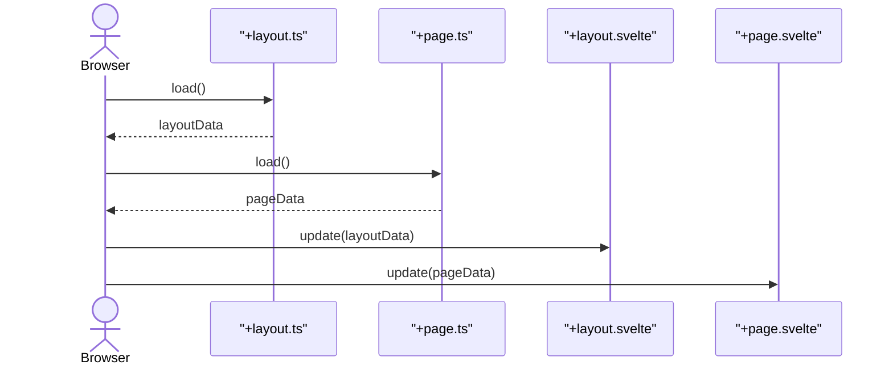

# ルーティング規則に基づくファイル

SvelteKit における「+がつくファイル」（通称：routing conventions に基づくファイル）は、主に以下の種類があります。それぞれが特定の役割を担っており、SvelteKitのルーティングやレンダリング、データロードの仕組みを支える要素です。

##  一覧：`+` がつくファイルの種類（主要なもの）

|ファイル名|役割|使用場所|
|---|---|---|
|`+page.svelte`|ページのUIを記述するコンポーネント|各ルート|
|`+page.ts/js`|クライアント・サーバー両対応のロード関数等|各ルート|
|`+page.server.ts/js`|サーバー専用のロード関数やアクションを定義|各ルート|
|`+layout.svelte`|レイアウト（共通UI）の定義|各階層ルート|
|`+layout.ts/js`|クライアント・サーバー共通のレイアウトロード|各階層ルート|
|`+layout.server.ts/js`|サーバー専用のレイアウトロード・アクション定義|各階層ルート|
|`+server.ts/js`|エンドポイントAPI（GET, POSTなど）を定義|各ルート or API|

##  補足的なファイル（フォームアクションやリダイレクトなど）

|ファイル名|用途例（補足）|
|---|---|
|`+error.svelte`|エラー表示ページ（レイアウトごとに設定可）|
|`+layout.reset.svelte`|レイアウトの継承をリセットしたい時|
|`+page.svelte` + `export const prerender = true;`|静的プリレンダー用ページ設定|
|`+page.ts` の `actions`|フォーム処理など（POST）に使う|

##  特別なディレクトリとの併用
- src/routes/api/hello/+server.ts などで API エンドポイントとして使用
- src/routes/[slug]/+page.ts のように動的パラメータと併用可

##  開発中に便利な考え方
- +page.svelte：何を表示するか
- +page.ts / +page.server.ts：どうデータを用意するか
- +layout.*：他のページでも共通して使うレイアウトやデータ
- +server.ts：APIとして振る舞わせるとき

## ファイル構成の視覚化（構成図 & シーケンス図）

SvelteKit の `+page.*`, `+layout.*`, `+server.*` 系ファイルの関係を図で表すことで、全体像をより直感的に理解できます。

###  Mermaid構成図：ファイル間の責務

### 🧭 Mermaidシーケンス図：初期表示時の流れ

---

### 🔄 Mermaidシーケンス図：クライアント遷移時の流れ（SPA）

### 区分別のまとめ表

| ファイル | ブラウザ側 | サーバ側 | 初回リクエスト | クライアント遷移 | 備考 |
|----|---|---|---|---|---|
| `+layout.svelte` | ✅ | | ✅ | ✅ | HTML構造（共通部） |
| `+layout.ts` | ✅ | ✅ | ✅ | ✅ | クライアントでも使える |
| `+layout.server.ts` | | ✅ | ✅ | ❌ | SSR時のみ |
| `+page.svelte` | ✅ | | ✅ | ✅ | ページ本体 |
| `+page.ts` | ✅ | ✅ | ✅ | ✅ | 両対応（isomorphic） |
| `+page.server.ts` | | ✅ | ✅ | ❌ | SSR時のみ |
| `+server.ts` | | ✅ | APIのみ | APIのみ | REST風APIエンドポイント |

## 🔗 参考（公式ドキュメント）
- SvelteKit Routing: https://kit.svelte.dev/docs/routing

