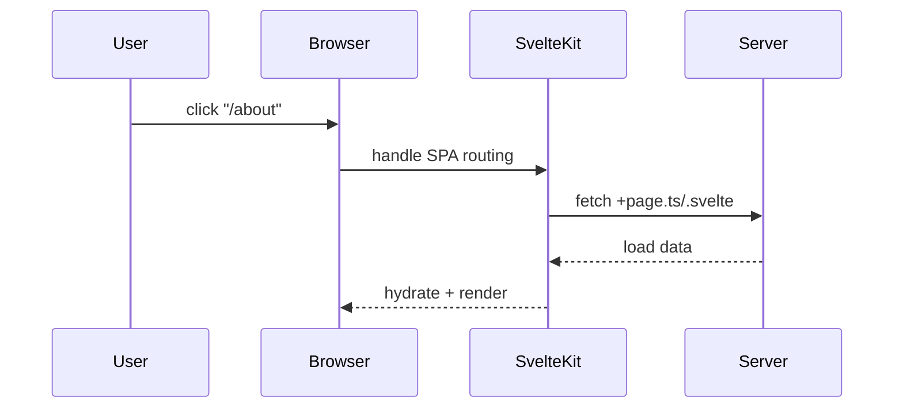
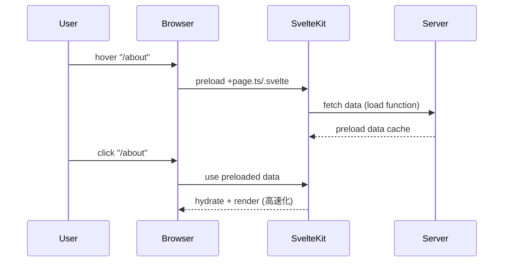
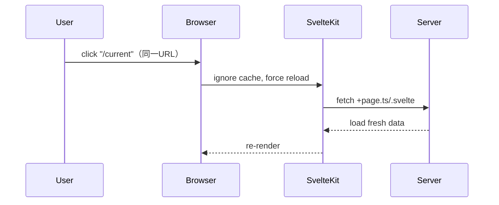

# SvelteKit の LinkOptions 属性比較

SvelteKit では、`<a>` 要素に特定の属性を付与することでリンクの挙動を制御できます。ここでは `data-sveltekit-preload-data` および `data-sveltekit-reload` の違いを表形式と図解でまとめます。

## ✅ 比較表：LinkOptions の属性の違い

| 属性                            | 目的                                                  | デフォルト | 発火タイミング                     | 使用例                                             |
|-------------------------------|-------------------------------------------------------|-----------|----------------------------------|--------------------------------------------------|
| `data-sveltekit-preload-data` | リンク先のデータ (`load` 関数の結果) を事前に取得     | なし      | `hover` または `tap` イベント時   | `<a href="/about" data-sveltekit-preload-data>` |
| `data-sveltekit-reload`       | 同じ URL でもページを強制的に再読み込みさせる         | なし      | リンククリック時                  | `<a href="/current" data-sveltekit-reload>`     |
| 通常リンク (`<a href="..." />`) | SPA 遷移で DOM 差分のみ描画。必要な時に `load()` 実行 | あり      | クリック時に自動的に SPA 遷移     | `<a href="/about">About</a>`                     |

## 🔁 関係表（用途別の使い分け）

| パターン                          | 発動タイミング           | 動作内容                            | 特徴                                   |
|----------------------------------|--------------------------|--------------------------------------|----------------------------------------|
| 通常リンク (`<a href="...">`)    | クリック時               | `load()` 実行                        | 通常の SPA 遷移                         |
| `data-sveltekit-preload-data`    | hover/tap 時             | `load()` 事前実行しキャッシュ       | クリック時に即表示（UX 高速化）       |
| `data-sveltekit-reload`          | クリック時               | 常に `load()` を再実行（再フェッチ） | 同一 URL でも強制リロード             |

## 📈 シーケンス図：`<a>` の属性ごとの動作の違い

### 通常リンク (`<a href="/about">About</a>`)

### `data-sveltekit-preload-data`

### `data-sveltekit-reload`

## 🧭 結論・使い分けガイド

| シナリオ                                          | 推奨属性                    |
|---------------------------------------------------|-----------------------------|
| ページ間の通常遷移                                | なし（通常リンク）         |
| 事前にページデータを先読みして高速化したい場合     | `data-sveltekit-preload-data` |
| 同じ URL でも強制的にリロードさせたい場合         | `data-sveltekit-reload`    |