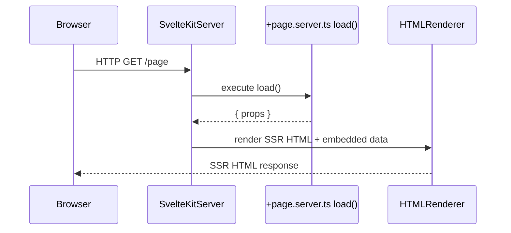
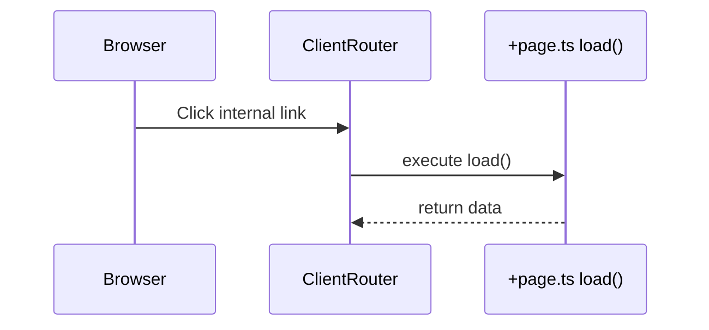
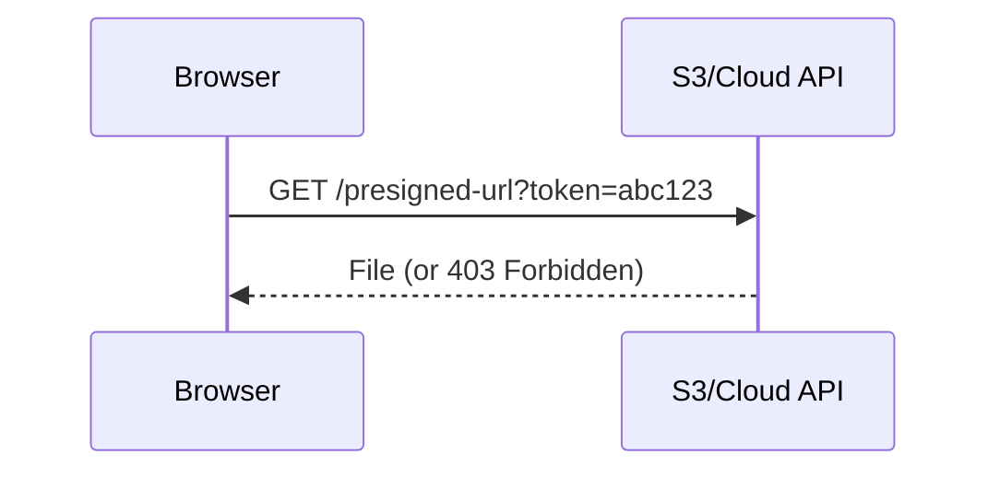
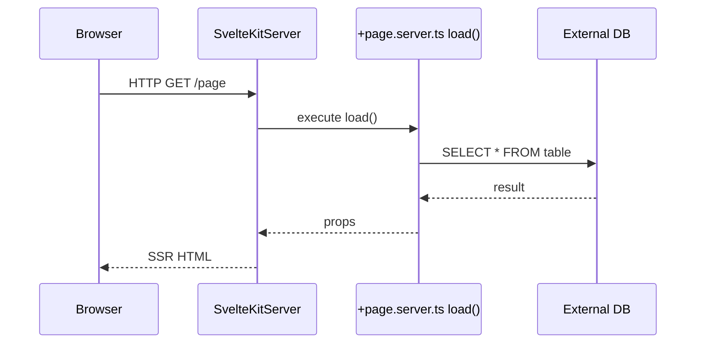
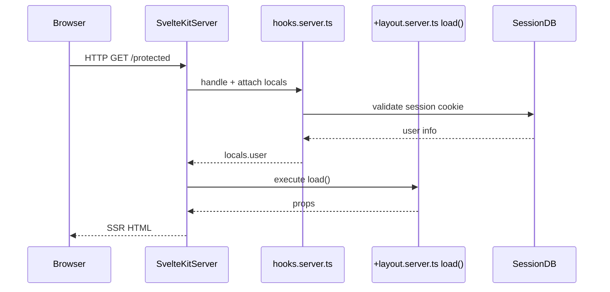

# `+page.ts` と `+page.server.ts` の実行タイミングと責任範囲図解

SvelteKitにおける `+page.ts` と `+page.server.ts` の `load()` 関数は、クライアント側とサーバ側で異なるタイミングと責任範囲で実行されます。以下にユースケース別の **Mermaidシーケンス図** を用いて、それらの違いを明示します。

## ✅ 初回アクセス時の処理フロー（SSR）

- `+page.server.ts` の `load()` が実行され、取得されたデータは HTML に埋め込まれる。
- `+page.ts` の `load()` は **この時点では実行されない**。

## 🔁 クライアント遷移（SPA）の場合の処理フロー

- ブラウザ内でのナビゲーション時は `+page.ts` の `load()` のみが実行される。
- HTTP通信は `fetch()` を使った場合にのみ発生。

## ☁️ プリサインドURLを用いた公開APIフェッチの例

- 実装場所: `+page.ts`、または `form action` 内 `fetch()`
- セキュアな一時的アクセスに使用される公開API例。

## 🗃 バックエンドDBアクセス（DBサーバ分離構成）

- DB が外部サーバにある場合でも、`+page.server.ts` の中で責任を持って接続・取得。
- クライアントからは DB に直接触れることはない。

## 🔐 認証付きページアクセス（hooks + layout）

このように、実行されるファイル・タイミング・通信先を図式化することで、`+page.ts` と `+page.server.ts` の役割と適切な使い分けがより明確になります。