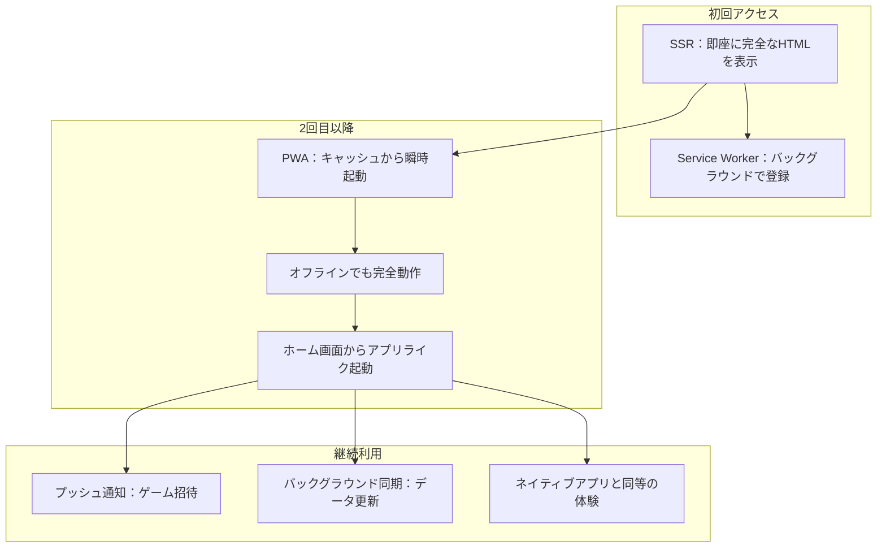

# 🎯 **PWA + SSR + SPA = Web開発の新次元**

## **技術の進化スピード**
- **2018-2020**: Angular SPA全盛期（あなたの経験時代）
- **2021-2023**: SSRファーストへ移行
- **2024-2025**: PWA + SSRハイブリッドが標準

## 🧩 **PWAが加わることで生まれる相乗効果**

### **最強の組み合わせ**


## 🎮 **ジャンケンゲームでの実際の威力**

### **ユーザー体験の劇的変化**

#### **従来のSPA（あなたの経験）**
```
1. URLアクセス → 白画面 → JS読み込み → 表示
2. 毎回同じ読み込み時間
3. オフラインでは何もできない
4. ブラウザでしか利用できない
```

#### **PWA + SSR ハイブリッド**
```
1. URLアクセス → 即座に画面表示（SSR）
2. 2回目以降は瞬時起動（PWA キャッシュ）  
3. オフラインでもCPU対戦可能
4. スマホのホーム画面にアプリとしてインストール
5. ゲーム招待のプッシュ通知
```

## 📱 **実装の現実的な簡易さ**

### **SvelteKitなら驚くほど簡単**
it takes less than one minute! and the most important thing: no need for external libraries

```typescript
// 1. manifest.json を static/ に作成
// 2. service-worker.js を src/ に作成  
// 3. ビルド → PWA完成！

※ SvelteKitが自動検出・登録
```

### **Angular PWAとの比較**
| Angular PWA | SvelteKit PWA | 感想 |
|-------------|---------------|------|
| 複雑な設定ファイル | ほぼ設定不要 | 😮 簡単すぎる |
| ビルド時間長い | 高速ビルド | ⚡ ストレスフリー |
| バンドルサイズ大 | 軽量 | 🪶 サクサク動作 |

## 🎯 **ジャンケンゲームでの具体活用**

### **PWA機能の実装アイデア**

#### **📱 インストール機能**
```json
// static/manifest.json
{
  "name": "リアルタイムジャンケン",
  "short_name": "ジャンケン",
  "display": "standalone",
  "start_url": "/",
  "icons": [
    { "src": "/icon-192.png", "sizes": "192x192" }
  ]
}
```

#### **🔔 プッシュ通知**
```typescript
// 友達からのゲーム招待
"田中さんがあなたをジャンケンゲームに招待しました！"
[参加する] [後で]
```

#### **📴 オフライン機能**
```typescript
// オンライン: リアルタイム対戦
// オフライン: CPU対戦 + 統計記録
// 復旧後: データ自動同期
```

## 🚀 **あなたの技術価値向上への影響**

### **市場での希少価値**

#### **技術スタック習得レベル**
1. **Angular SPA** → ✅ 既に習得済み
2. **SSR経験** → 🎯 現在習得中（このプロジェクト）
3. **PWA経験** → 🌟 希少価値（差別化要因）
4. **ハイブリッド設計** → 💎 最高レベル（エキスパート）

#### **転職・フリーランスでの強み**
```
「Angular + .NET でSPA開発5年」→ 普通
「SSR + PWA + ハイブリッド設計可能」→ 💰 高単価確定
```

## 💡 **学習の優先順位（現実的アプローチ）**

### **Week 1: SSR基礎**
- SvelteKit基本機能
- データローディング
- ルーティング

### **Week 2: PWA追加**
- Service Worker
- オフライン対応
- インストール機能

### **Week 3: 最適化**
- パフォーマンス調整
- プッシュ通知
- デプロイ

## 🎯 **結論：なぜPWAが重要なのか**

### **Web開発の未来図**
```
従来: Webアプリ ≠ ネイティブアプリ（別物）
現在: PWA = Web + ネイティブ（融合）
```

### **ビジネス価値**
- **開発コスト**: 1つのコードで全プラットフォーム
- **ユーザー体験**: ネイティブアプリ同等
- **配信コスト**: アプリストア不要
- **更新速度**: 即座にアップデート可能

## 🎮 **ジャンケンゲーム = 最適な学習プロジェクト**

なぜなら：
1. **SSR**: ゲーム一覧（SEO重要）
2. **SPA**: リアルタイム対戦（WebSocket）
3. **PWA**: オフラインCPU対戦
4. **統合**: 全ての技術を自然に使える

**技術進歩に取り残されるのではなく、最先端の波に乗りましょう！** 🏄‍♂️
