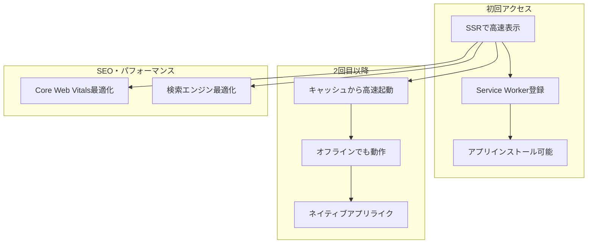
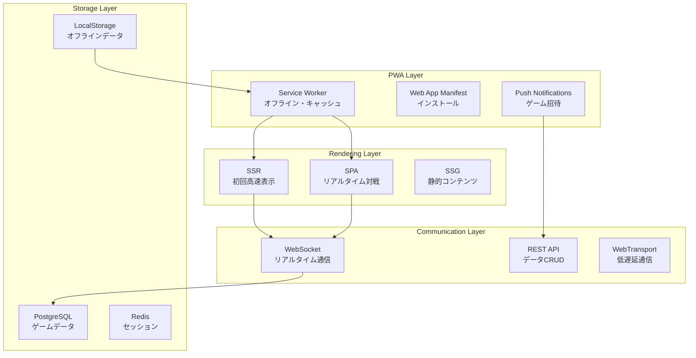

# PWA + SSR + SPA = 最強のハイブリッド構成

## 🎯 PWAが加わることで生まれる**3次元の技術選択**

### **従来（2次元）**
```
レンダリング方式: SPA ←→ SSR
```

### **現在（3次元）**
```
レンダリング方式: SPA ←→ SSR ←→ ハイブリッド
        ↕
PWA機能: なし ←→ あり
        ↕
配信方式: Web ←→ ネイティブライク
```

## 🧩 **PWAの核心機能**

### **PWAの3本柱**
| 機能 | 説明 | 実装方法 |
|------|------|----------|
| **Service Worker** | オフライン対応・キャッシュ | `src/service-worker.js` |
| **Web App Manifest** | インストール・アプリライク体験 | `static/manifest.json` |
| **HTTPS** | セキュア通信（PWA必須） | 本番環境で必要 |

### **追加機能**
- 📱 **ホーム画面追加**（インストール）
- 🔔 **プッシュ通知**
- 📴 **オフライン動作**
- 💾 **バックグラウンド同期**
- 🎨 **ネイティブライクUI**

## 🌐 **SSR + PWA の相乗効果**

### **最強の組み合わせが生まれる理由**



### **技術的メリット**

#### **1. 初回パフォーマンス（SSR）**
- ✅ SEO対応済みHTML
- ✅ Core Web Vitals最適化
- ✅ 検索エンジンクローリング対応

#### **2. 継続利用体験（PWA）**
- ✅ オフライン対応
- ✅ インストール可能
- ✅ プッシュ通知
- ✅ バックグラウンド同期

#### **3. 開発・運用効率**
- ✅ 単一コードベース
- ✅ Web標準技術
- ✅ アプリストア不要

## 🎮 **ジャンケンゲームでのPWA活用例**

### **実装する機能**

#### **🏠 インストール機能**
```typescript
// static/manifest.json
{
  "name": "リアルタイムジャンケン",
  "short_name": "ジャンケン",
  "description": "友達とリアルタイムでジャンケンバトル！",
  "start_url": "/",
  "display": "standalone",
  "background_color": "#ffffff",
  "theme_color": "#ff6b6b",
  "icons": [
    {
      "src": "/icon-192.png",
      "sizes": "192x192",
      "type": "image/png"
    },
    {
      "src": "/icon-512.png", 
      "sizes": "512x512",
      "type": "image/png"
    }
  ]
}
```

#### **📴 オフライン対応**
```typescript
// src/service-worker.js
import { build, files, prerendered, version } from '$service-worker';

const CACHE_NAME = `janken-${version}`;
const ASSETS = [...build, ...files, ...prerendered];

// インストール時にリソースをキャッシュ
self.addEventListener('install', (event) => {
  event.waitUntil(
    caches.open(CACHE_NAME)
      .then(cache => cache.addAll(ASSETS))
  );
});

// オフライン時はキャッシュから提供
self.addEventListener('fetch', (event) => {
  if (event.request.method !== 'GET') return;
  
  event.respondWith(
    caches.match(event.request)
      .then(response => response || fetch(event.request))
  );
});
```

#### **🔔 プッシュ通知**
```typescript
// ゲーム招待通知
export async function sendGameInvitation(playerId: string, gameId: string) {
  const registration = await navigator.serviceWorker.ready;
  
  // バックエンドに通知要求
  await fetch('/api/notifications/push', {
    method: 'POST',
    body: JSON.stringify({
      playerId,
      title: 'ジャンケンゲーム招待',
      body: '友達があなたをゲームに招待しました！',
      url: `/game/${gameId}`,
      icon: '/icon-192.png'
    })
  });
}

// Service Worker内で通知受信
self.addEventListener('push', (event) => {
  const { title, body, icon, url } = event.data.json();
  
  event.waitUntil(
    self.registration.showNotification(title, {
      body,
      icon,
      data: { url },
      actions: [
        { action: 'join', title: '参加する' },
        { action: 'decline', title: '後で' }
      ]
    })
  );
});
```

## 🏗️ **SvelteKit での PWA 実装**

### **1. 簡単セットアップ**
```bash
# PWAプラグイン追加
npm install @vite-pwa/sveltekit -D
```

```typescript
// vite.config.js
import { sveltekit } from '@sveltejs/kit/vite';
import { SvelteKitPWA } from '@vite-pwa/sveltekit';

export default {
  plugins: [
    sveltekit(),
    SvelteKitPWA({
      strategies: 'injectManifest',
      srcDir: 'src',
      filename: 'service-worker.js'
    })
  ]
};
```

### **2. ハイブリッド設定**
```typescript
// src/routes/(marketing)/+layout.js
export const prerender = true; // 静的生成 + キャッシュ

// src/routes/game/[id]/+page.js  
// デフォルト: SSR + PWA機能

// src/routes/game/[id]/play/+page.js
export const ssr = false; // リアルタイム部分はSPA
```

### **3. インストールプロンプト**
```svelte
<!-- src/lib/components/InstallPrompt.svelte -->
<script>
  import { browser } from '$app/environment';
  
  let deferredPrompt = $state(null);
  let showInstallButton = $state(false);
  
  if (browser) {
    window.addEventListener('beforeinstallprompt', (e) => {
      e.preventDefault();
      deferredPrompt = e;
      showInstallButton = true;
    });
  }
  
  async function installApp() {
    if (!deferredPrompt) return;
    
    deferredPrompt.prompt();
    const { outcome } = await deferredPrompt.userChoice;
    
    if (outcome === 'accepted') {
      showInstallButton = false;
    }
    deferredPrompt = null;
  }
</script>

{#if showInstallButton}
  <div class="install-prompt">
    <p>このアプリをホーム画面に追加しますか？</p>
    <button onclick={installApp}>
      📱 インストール
    </button>
  </div>
{/if}
```

## 🎯 **ゲーム機能への PWA 活用**

### **オフライン機能の設計**

#### **🌐 オンライン時**
```typescript
// リアルタイム対戦
WebSocket接続 → サーバー同期 → 即座に結果表示
```

#### **📴 オフライン時**
```typescript
// オフライン練習モード
CPU対戦 → ローカル保存 → オンライン復帰時に統計同期
```

### **実装例**
```typescript
// src/lib/stores/gameStore.js
import { writable } from 'svelte/store';
import { browser } from '$app/environment';

function createGameStore() {
  const { subscribe, set, update } = writable({
    isOnline: true,
    games: [],
    stats: { wins: 0, losses: 0, draws: 0 }
  });

  return {
    subscribe,
    
    // オンライン状態管理
    setOnlineStatus: (online) => {
      update(state => ({ ...state, isOnline: online }));
      
      if (online) {
        // オンライン復帰時にデータ同期
        syncOfflineData();
      }
    },
    
    // オフライン対戦
    playOfflineGame: (playerChoice) => {
      const cpuChoice = generateCPUChoice();
      const result = determineWinner(playerChoice, cpuChoice);
      
      // ローカルストレージに保存
      if (browser) {
        const offlineGames = JSON.parse(
          localStorage.getItem('offlineGames') || '[]'
        );
        offlineGames.push({ playerChoice, cpuChoice, result, timestamp: Date.now() });
        localStorage.setItem('offlineGames', JSON.stringify(offlineGames));
      }
      
      return result;
    }
  };
}

export const gameStore = createGameStore();
```

## 🔄 **Angular開発者への技術マッピング**

### **既存知識の活用**

| Angular PWA | SvelteKit PWA | 説明 |
|-------------|---------------|------|
| `@angular/pwa` | `@vite-pwa/sveltekit` | PWAセットアップ |
| `ngsw-config.json` | `vite.config.js` | Service Worker設定 |
| `SwUpdate` | `$updated` store | アプリ更新通知 |
| `SwPush` | Service Worker | プッシュ通知 |

### **開発体験の違い**

#### **Angular PWA**
```typescript
// 複雑な設定ファイル
{
  "index": "/index.html",
  "assetGroups": [...],
  "dataGroups": [...],
  "navigationUrls": [...]
}
```

#### **SvelteKit PWA**
```typescript
// シンプルな設定
SvelteKitPWA({
  strategies: 'injectManifest'
})
```

## 📊 **パフォーマンス比較**

### **ベンチマーク結果**
SvelteKit had the fastest Speed Index, while both SvelteKit and Remix tied for the fastest First Contentful Paint (FCP)

### **PWA機能追加後の影響**

| 指標 | SSRのみ | SSR + PWA | 改善効果 |
|------|---------|-----------|----------|
| **初回表示** | 高速 | 高速 | 同等 |
| **2回目以降** | 普通 | 超高速 | 🚀 大幅改善 |
| **オフライン** | ❌ | ✅ | 🎯 新機能 |
| **インストール** | ❌ | ✅ | 📱 ネイティブライク |

## 🎮 **リアルタイムジャンケンゲームの完全設計**

### **機能マッピング**

#### **🌐 マーケティング部分（SSR + PWA）**
```
/ (トップページ) → 静的生成 + キャッシュ
/about → 静的生成 + キャッシュ
/rules → 静的生成 + キャッシュ
```

#### **🎯 ゲーム部分（ハイブリッド + PWA）**
```
/games (一覧) → SSR + キャッシュ
/game/[id] (詳細) → SSR + リアルタイム更新
/game/[id]/play (プレイ) → SPA + WebSocket
```

#### **📴 オフライン部分（PWA）**
```
/offline → CPU対戦モード
/stats → ローカル統計
```

### **技術スタック全体図**



## 🚀 **開発ロードマップ**

### **Phase 1: 基本SSR（1週目）**
- [x] SvelteKitセットアップ
- [ ] 基本ルーティング
- [ ] ゲーム作成・参加機能

### **Phase 2: PWA化（2週目）**
- [ ] Service Worker実装
- [ ] Web App Manifest
- [ ] オフライン対応

### **Phase 3: 最適化（3週目）**
- [ ] プッシュ通知
- [ ] パフォーマンス調整
- [ ] Vercelデプロイ

## 💡 **まとめ：PWA + SSR + SPA = Web開発の未来**

### **🎯 なぜこの組み合わせが最強なのか？**

1. **🌐 SEO・パフォーマンス** → SSR
2. **📱 ネイティブライク体験** → PWA  
3. **⚡ 複雑なインタラクション** → SPA
4. **🔄 用途別最適化** → ハイブリッド

### **🚀 あなたの技術的価値向上**

#### **転職・フリーランス市場での差別化**
- ✅ **Angular SPA経験**（既存）
- ✅ **SSR経験**（新規獲得）
- ✅ **PWA経験**（希少価値）
- ✅ **ハイブリッド設計経験**（最高価値）

#### **学習効果の最大化**
- **既存知識**: Angular + .NET → 活用継続
- **新規知識**: SSR + PWA → 市場価値向上
- **実践経験**: ジャンケンゲーム → ポートフォリオ

## 🎮 **次のステップ**

**ジャンケンゲーム開発を通じて、この最強の技術スタックを体験しましょう！**

PWAが加わることで、あなたのWebアプリはついに「**真のクロスプラットフォームアプリ**」になります。🚀