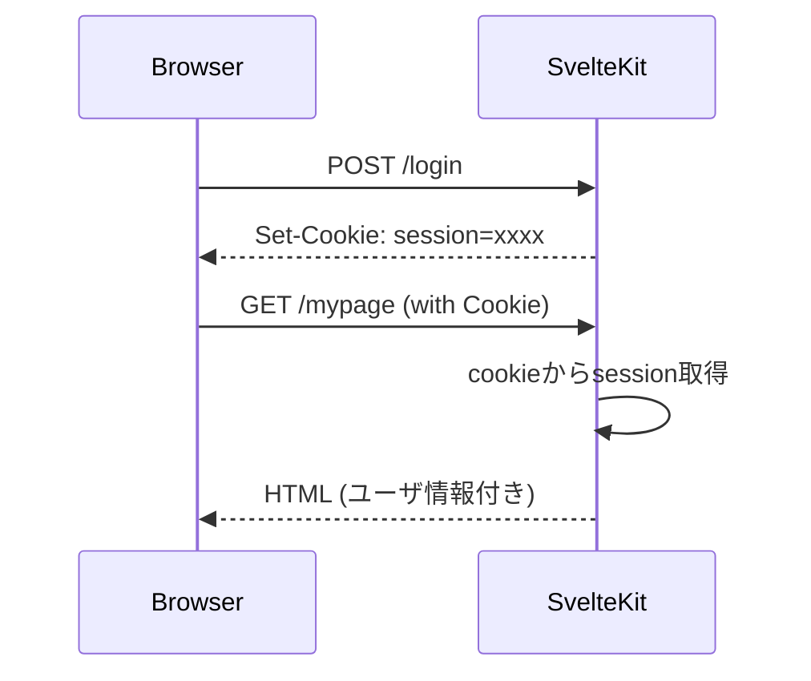
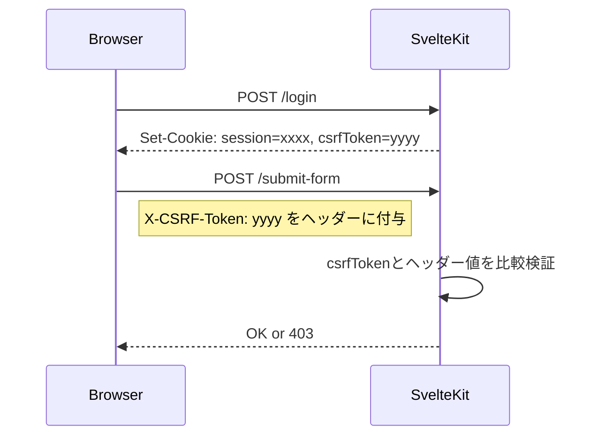
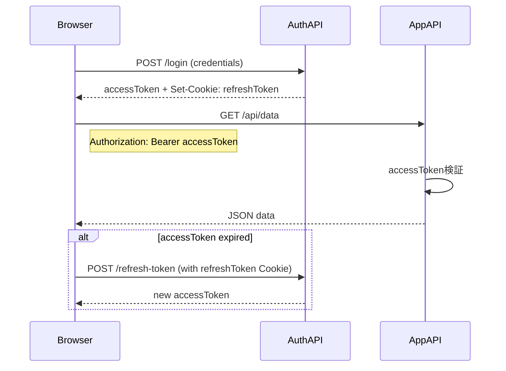

# SvelteKit でのセッション管理

SvelteKit でのセッション管理は、設計次第で柔軟に対応できますが、SSR（サーバサイドレンダリング）とフロントエンドの統合という特徴から、Cookieベースのセッション管理が自然にマッチします。
一方、WebAPI（RESTなど）中心のSPA構成では、JWTベースの認証が一般的です。

ここでは、それぞれの特徴と、ブラウザ側の保存方法、サーバ側での扱い方を比較しながら説明します。

## 🔐 SvelteKitにおけるセッション・認証の選択肢

|構成|主な利用技術|セッション維持|備考|
|---|---|---|---|
|SSR + Cookie|Cookie + HttpOnly|セッションID or JWT|サーバで状態を保持（もしくはJWTをサーバ側で検証）|
|SPA + REST API|JWT (access/refresh)|localStorage/sessionStorage or Cookie|フロントエンド主導、状態レスのAPI設計にマッチ|


## 1. SSR + Cookie 認証（SvelteKitに自然）

### 🔸ブラウザ側
- 認証成功時、Set-CookieヘッダーでセッションIDやJWTをHttpOnly属性付きで付与
- SvelteKitのload関数やhooks.server.tsで、cookies.get()で読み取り可能
- セキュリティの観点から、**JSから直接読み取れない（HttpOnly）**のがメリット

### 🔸サーバ側
- Cookieに格納されたセッションIDやJWTをevent.cookies.get('session')などで読み出し、ユーザ情報に変換
- 例えば、hooks.server.tsで以下のように使用：

```ts
// src/hooks.server.ts
export const handle = async ({ event, resolve }) => {
  const session = event.cookies.get('session');
  if (session) {
    // JWTを検証し、ユーザー情報をevent.localsに保存
    event.locals.user = verifyJWT(session);
  }
  return resolve(event);
};
```

### 🔁 シーケンス図



### 解説
- セッション情報（session IDやJWTなど）をHttpOnlyなCookieとして発行
- SvelteKitの `hooks.server.ts` で常にCookieを検査して認証状態を維持


## 2. SSR + Cookie + CSRF（Cross-Site Request Forgery） 対策あり


SvelteKitでCookieベースのセッション管理を行う場合、CSRF（クロスサイトリクエストフォージェリ）への対策が必要になります。これは、Cookieが自動で送信されるため、外部サイトからの不正リクエストもサーバに到達してしまうリスクがあるためです。

### 対策の基本構成

| 要素 | 説明 |
|------|------|
| セッション管理 | `HttpOnly` な Cookie でセッションIDやJWTを管理 |
| トークン配置 | サーバで生成したCSRFトークンを HTML に埋め込み or JavaScript で取得 |
| トークン送信 | `fetch` や `<form>` 送信時に `X-CSRF-Token` ヘッダで送る |
| サーバ検証 | `hooks.server.ts` や `+server.ts` 側でトークンを検証 |

---

### 🔧 実装例

#### 1. ログイン時にCSRFトークンを発行

```ts
// src/routes/login/+server.ts
import { generateCSRFToken } from '$lib/csrf';

export const POST = async ({ cookies }) => {
  const csrfToken = generateCSRFToken();
  cookies.set('csrfToken', csrfToken, {
    path: '/',
    httpOnly: false,
    sameSite: 'Strict',
    secure: true
  });

  cookies.set('session', createSessionToken(), {
    path: '/',
    httpOnly: true,
    sameSite: 'Strict',
    secure: true
  });

  return new Response('Logged in');
};
```

#### 2. フロントエンドからfetch送信時にヘッダー付与

```ts
const csrfToken = document.cookie
  .split('; ')
  .find((row) => row.startsWith('csrfToken='))
  ?.split('=')[1];

await fetch('/api/protected-action', {
  method: 'POST',
  headers: {
    'X-CSRF-Token': csrfToken!
  },
  body: JSON.stringify({ ... })
});
```

#### 3. サーバ側でトークン検証

```ts
// src/routes/api/protected-action/+server.ts
export const POST = async ({ request, cookies }) => {
  const csrfTokenHeader = request.headers.get('x-csrf-token');
  const csrfTokenCookie = cookies.get('csrfToken');

  if (!csrfTokenHeader || csrfTokenHeader !== csrfTokenCookie) {
    return new Response('Forbidden', { status: 403 });
  }

  return new Response('OK');
};
```

### 🔁 シーケンス図



### 解説
- sessionは `HttpOnly` Cookie に、csrfTokenはJSで参照できるよう非HttpOnlyで発行
- フォームやfetch POST時に `X-CSRF-Token` ヘッダーを必ず付ける
- SvelteKit側で一致を検証してCSRFを防止


## 3. SPA + REST API + JWT（accessToken + refreshToken）ベースの認証

### 🔸ブラウザ側

トークン	保存場所	特徴
accessToken	localStorage や memory	使いやすいがXSS耐性は弱い
refreshToken	Cookie (HttpOnly)	安全にするにはHttpOnlyなCookieが推奨される

- fetch()でAPI呼び出し時にAuthorization: Bearer <accessToken>をつける
- accessTokenが失効していたら、refreshToken（Cookie）を使って再発行

### 🔸サーバ側
- accessTokenの検証：署名チェックと有効期限チェック
- refreshTokenの検証と再発行

```ts
// SvelteKit API Route例: /api/refresh-token/+server.ts
export const POST = async ({ cookies }) => {
  const refreshToken = cookies.get('refreshToken');
  if (!refreshToken) return new Response('Unauthorized', { status: 401 });

  const user = verifyRefreshToken(refreshToken);
  if (!user) return new Response('Unauthorized', { status: 401 });

  const newAccessToken = createAccessToken(user);
  return new Response(JSON.stringify({ accessToken: newAccessToken }));
};
```

### 🔁 シーケンス図



### 解説
- `accessToken` は短命で JS上に保持（メモリやlocalStorage）
- `refreshToken` は `HttpOnly Cookie` に保存し、安全に再発行操作を実現
- API呼び出し前にaccessTokenの有効性を確認し、切れていればリフレッシュを実行


## 組み合わせのベストプラクティス（セキュアかつ快適）
- accessToken: JavaScript側でメモリにのみ保持（推奨）
- refreshToken: HttpOnly Cookieに保存（Secure + SameSite=Strict）
- 認証が必要なAPI呼び出し時、accessTokenが失効していたら /api/refresh-token を自動で呼ぶように設計

## SvelteKitにおける実装イメージ

```ts
// src/hooks.server.ts
import { verifyJWT } from '$lib/auth';

export const handle = async ({ event, resolve }) => {
  const token = event.cookies.get('session'); // または accessToken
  if (token) {
    const user = verifyJWT(token);
    if (user) event.locals.user = user;
  }
  return resolve(event);
};

// src/routes/+layout.server.ts
export const load = async ({ locals }) => {
  return { user: locals.user ?? null };
};
```

## 結論：どちらを使うべきか？

|要件|推奨される方法|
|---|---|
|SSRでセッションが必要|Cookieベースセッション（HttpOnly）|
|SPA的にAPI中心設計|JWT（accessToken + refreshToken）|
|高セキュリティ（XSS・CSRF対策）|refreshTokenはCookie(HttpOnly, Secure)、accessTokenはmemory保持|
|SvelteKit単体で完結|Cookie + hooks.server.ts でユーザ管理|


### 💡 ベストプラクティス

- `SameSite=Strict` をCookieに指定する
- 認証トークン（session/JWT）は `HttpOnly`
- CSRFトークンは `非HttpOnly` にしてJSで読み取らせる
- 状態変更を伴うすべてのリクエストで `X-CSRF-Token` を送信し検証する

フォーム送信を使う `form actions` 構成でも、`request.headers.get()` でヘッダーを検証可能です。

