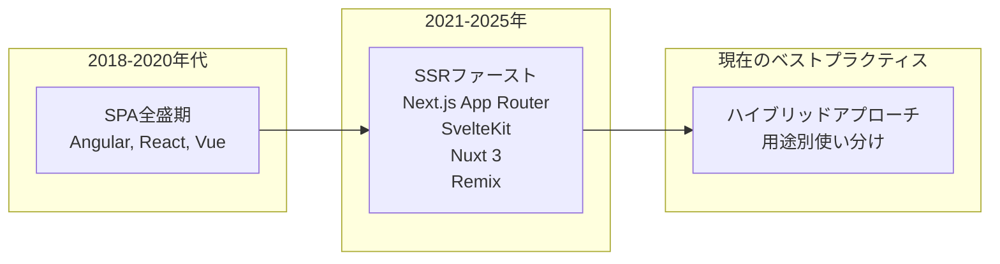
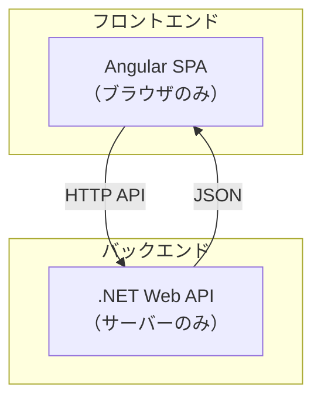
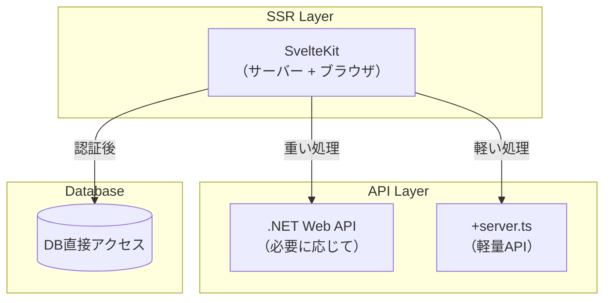

# SPA vs SSR: 2025年のWebアーキテクチャトレンド

## 🎯 答え：**ハイブリッド時代** - SPAの完全置き換えではなく使い分けが主流

### **現在の業界動向（2024-2025）**



## 📊 **フレームワーク別SSR対応状況**

| フレームワーク | SSRサポート | トレンド | 2025年の立ち位置 |
|-------------|-----------|---------|----------------|
| **Next.js** | ✅ App Router (SSR First) | 📈 強化中 | React SSRの標準 |
| **SvelteKit** | ✅ SSR First | 📈 急成長 | 軽量・高速SSR |
| **Nuxt 3** | ✅ SSR First | 📈 Vue界の主流 | Vue SSRの標準 |
| **Remix** | ✅ SSR専用 | 📈 React Router統合予定 | プログレッシブエンハンスメント |
| **Angular** | ⚠️ SSRオプション | 📉 SPA中心のまま | 企業向けSPA |
| **Create React App** | ❌ SPAのみ | 📉 メンテナンス停止 | 非推奨 |

## 🌐 **SSRが主流になっている理由**

### 1. **SEO & パフォーマンス**
```typescript
// ❌ SPA（Angular）の問題
// 初期HTML
<div id="app">Loading...</div>

// SEOクローラーが見るもの：「Loading...」のみ
// Core Web Vitals: LCP（Large Contentful Paint）が遅い
```

```typescript
// ✅ SSR（SvelteKit）の解決
// 初期HTML（サーバーで生成）
<div>
  <h1>ジャンケンゲーム一覧</h1>
  <div class="games">
    <div class="game">ゲーム1: 進行中</div>
    <div class="game">ゲーム2: 募集中</div>
  </div>
</div>

// SEOクローラーが見るもの：完全なコンテンツ
// Core Web Vitals: 大幅改善
```

### 2. **Core Web Vitals の重要性**
Google Lighthouse は、Google 検索アルゴリズムのランキング要素となっている Core Web Vitals（LCP、FID、CLS）を測定します。

Google 検索ボットは JavaScript を実行しますが、このプロセスは純粋な HTML スキャン（JavaScript なし）よりも信頼性が低く（頻度も低くなります）、サーバー側でレンダリングされたコンテンツはより信頼性が高く、より頻繁にインデックスされます。

### 3. **パフォーマンス比較結果**
SvelteKitはスピードインデックスが最も速く、SvelteKitとRemixはどちらもファーストコンテンツペイント（FCP）で同率最速でした。

## 🎮 **実際のアプリケーション別アプローチ**

### **🌟 SSR/SSGが適している領域** 
```typescript
// マーケティングサイト、ブログ、ECサイト
export const prerender = true; // 静的生成

// ゲーム詳細ページ
export const load = async ({ params }) => {
  const game = await getGameInfo(params.id);
  return { game }; // サーバーで事前レンダリング
};
```

### **⚡ SPAが適している領域**
```typescript
// 管理画面、ダッシュボード、複雑なインタラクション
export const ssr = false; // SPA化
export const csr = true;  // クライアントサイドレンダリング

// リアルタイムチャット、ゲーム操作画面
// WebSocket接続、頻繁な状態更新が必要
```

## 🏗️ **ハイブリッドアプローチの実例**

### **SvelteKit での使い分け**
```
src/routes/
├── +layout.svelte           # 🌐 共通レイアウト（SSR）
├── (marketing)/             # 🌐 マーケティング（SSR/SSG）
│   ├── +page.svelte         # トップページ
│   ├── pricing/+page.svelte # 料金ページ
│   └── about/+page.svelte   # 会社情報
├── game/[id]/               # 🔄 ゲーム詳細（SSR + SPA）
│   ├── +page.svelte         # 初期表示はSSR
│   └── play/+page.svelte    # プレイ画面はSPA
└── (app)/                   # ⚡ アプリケーション（SPA）
    ├── dashboard/+page.svelte
    └── settings/+page.svelte
```

### **ページ別設定例**
```typescript
// src/routes/(marketing)/+layout.js
export const prerender = true; // 静的生成

// src/routes/game/[id]/+page.js  
// デフォルト：SSR + CSR（ハイブリッド）

// src/routes/(app)/+layout.js
export const ssr = false; // SPA化
export const csr = true;
```

## 🔄 **.NET開発者への対応表**

### **従来の構成 vs 新しい構成**

#### **従来（あなたの経験）**


#### **新しいハイブリッド構成**


## 💼 **エンタープライズでの採用状況**

### **大手企業の動向**
| 企業 | 従来 | 現在 | 理由 |
|------|------|------|------|
| **Netflix** | React SPA | Next.js SSR | SEO + パフォーマンス |
| **Spotify** | Angular SPA | Next.js Hybrid | Core Web Vitals改善 |
| **Hulu** | React SPA | Next.js SSR | 初期表示速度 |
| **GitHub** | Rails + JS | Rails + SSR | プログレッシブエンハンスメント |

### **日本企業での採用例**
- **メルカリ**: React SPA → Next.js SSR
- **サイボウズ**: 一部サービスでSSR採用
- **リクルート**: Next.js SSRを新規サービスで採用

## 🎯 **Angular開発者の移行パターン**

### **段階的移行戦略**
```typescript
// Phase 1: 既存Angular（継続）
// 管理画面、ダッシュボード等

// Phase 2: 新規機能をSSR
// マーケティングページ、商品詳細等

// Phase 3: ハイブリッド最適化
// 用途別に最適な手法を選択
```

### **移行時の技術対応表**
| Angular概念 | SvelteKit SSR対応 | 用途 |
|------------|------------------|------|
| `Component` | `+page.svelte` | UI定義 |
| `Guard` | `+page.server.ts` load | 認証チェック |
| `Resolver` | `+page.ts` load | データ事前取得 |
| `Service` | `+server.ts` | API提供 |
| `HttpInterceptor` | `hooks.server.ts` | 共通処理 |

## 🚀 **2025年のベストプラクティス**

### **✅ 推奨アプローチ**

#### **新規プロジェクト**
1. **SSRファーストで開始**（SvelteKit、Next.js等）
2. **必要に応じてSPA化**（管理画面等）
3. **静的生成も併用**（マーケティングページ）

#### **既存Angularプロジェクト**  
1. **既存システムは継続利用**
2. **新機能から段階的にSSR導入**
3. **SEO重要なページを優先的にSSR化**

### **❌ 避けるべきパターン**
- 全てをSPAで構築（SEO・パフォーマンス問題）
- 全てをSSRで構築（複雑なインタラクション低下）
- 技術選定の一貫性欠如

## 🎮 **ジャンケンゲームでの実装例**

### **ハイブリッド設計**
```typescript
// 🌐 ゲーム一覧（SEO重要）→ SSR
// src/routes/+page.svelte
export const load = async () => ({
  games: await getPublicGames()
});

// 🔄 ゲーム詳細（SEO + インタラクション）→ SSR + CSR
// src/routes/game/[id]/+page.svelte  
export const load = async ({ params }) => ({
  game: await getGameInfo(params.id)
});

// ⚡ プレイ画面（リアルタイム重要）→ SPA
// src/routes/game/[id]/play/+page.js
export const ssr = false; // WebSocket接続のため
```

## 🔮 **今後の予測（2025-2027）**

### **技術トレンド**
1. **SSRファーストが標準**になる
2. **Progressive Enhancement**の重要性増加
3. **Edge Computing**によるSSR高速化
4. **AI生成コンテンツ**のSSR最適化

### **Angular の立ち位置**
- **エンタープライズSPA**の地位は継続
- **Angular Universal**（SSR）の強化
- **新規プロジェクト**ではSSRファースト検討が必要

## 💡 **結論：技術選択の指針**

### **🎯 プロジェクト別推奨技術**

| プロジェクト種別 | 推奨技術 | 理由 |
|----------------|---------|------|
| **マーケティングサイト** | SvelteKit SSG | SEO + 高速 |
| **ECサイト** | Next.js SSR | SEO + 豊富なエコシステム |
| **ブログ・CMS** | SvelteKit SSR | 軽量 + パフォーマンス |
| **管理画面** | Angular SPA | 複雑なフォーム + 既存資産 |
| **リアルタイムゲーム** | SvelteKit Hybrid | SSR + SPA組み合わせ |
| **ダッシュボード** | React SPA or Angular | インタラクション重視 |

### **🚀 あなたへの推奨移行戦略**

1. **既存Angular**: 継続利用しつつ、新機能でSSR検証
2. **学習**: SvelteKit でハイブリッド開発体験
3. **転職・フリーランス**: SSR経験は強い差別化要因
4. **ジャンケンゲーム**: 最適なSSR + SPA組み合わせの実践例

**SSRは確実に主流ですが、SPAを完全に置き換えるものではありません。用途に応じた使い分けが2025年のスタンダードです！**