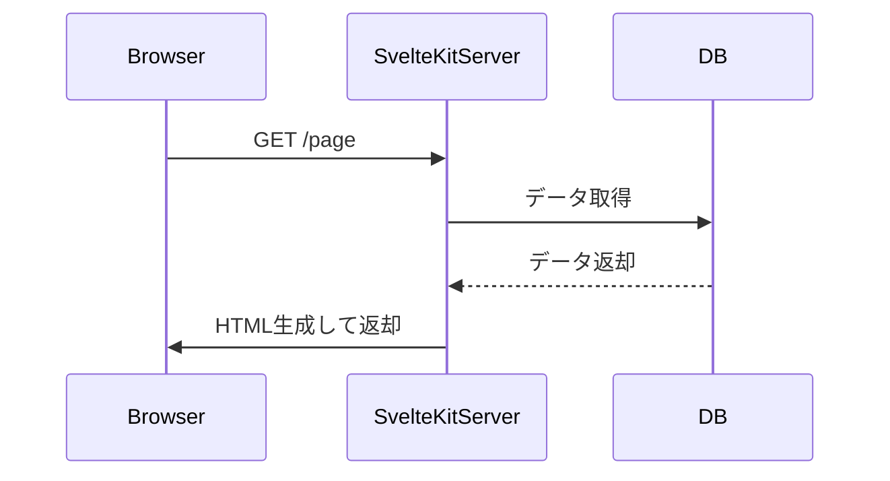
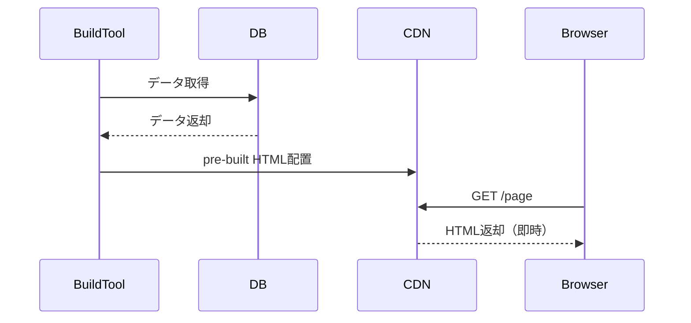

# SvelteKitの SSR、SSG、prerender

## ✅ 目次
1. 各用語の定義と概要
2. 違いの比較表
3. シーケンス図（初回アクセス時のフロー）
4. prerender の設定方法と制御
5. どの方式を選ぶべきか？

## 🔹 1. 用語の定義

用語|正式名称|概要
---|---|---
SSR|Server Side Rendering|リクエスト時にサーバーが HTML を生成し返す
SSG|Static Site Generation|ビルド時に HTML を生成し、静的ファイルとして配信
Prerender|事前レンダリング|特定のルートのみ SSG 化する設定（SvelteKit用語）


### 🔸 SSR（サーバーサイドレンダリング）
- リクエストのたびに HTML をサーバーで生成
- リアルタイムなデータ（認証、DB情報など）に強い
- SvelteKit ではデフォルトで SSR

### 🔸 SSG（静的サイト生成）
- ビルド時に HTML を生成し、静的にホスティング
- CDN に配置し高速配信可能
- 全体が静的であることが前提

### 🔸 Prerender（事前レンダリング）【SvelteKit用語】
- SSG のルート単位設定版
- ページごとに export const prerender = true を設定して静的生成

## 🔹 2. 違いの比較表

特性|SSR|SSG / Prerender
---|---|---
実行タイミング|リクエスト時|ビルド時
必要なサーバー|必須（Nodeなど）|不要（CDN/静的ホスティング可能）
動的データ対応|◎ リアルタイム対応可|× ビルド後は更新不可
SEO対応|◎|◎|
初回表示速度|△（ネットワーク依存）|◎（CDN高速配信）
例|会員ページ、管理画面|ブログ記事、会社概要など


## 🔹 3. シーケンス図で理解

✅ SSR：サーバー側で都度HTMLを生成



## ✅ SSG（Prerender）：ビルド時にHTML生成済み



## 🔹 4. Prerender 設定方法（SvelteKit）

ページ単位で設定：

```ts
// +page.ts / +layout.ts
export const prerender = true;
```

全体を SSG にしたいとき（svelte.config.js）：

```ts
kit: {
  prerender: {
    entries: ['*']  // 全ルートを静的化
  }
}
```
特定ルートだけ除外：

```ts
// +page.ts
export const prerender = false;
```

## 🔹 5. どれを使うべきか？

条件|推奨方式
---|---
認証が必要／動的データ|SSR
完全に静的なページ|Prerender（SSG）
高速配信・SEO重視|Prerender + CDN
ハイブリッド（動的+静的）|SSR + 一部 Prerender


## ✅ 結論
- SvelteKit は SSR がデフォルトですが、ルート単位で prerender = true を指定することで SSG 化できます。
- これにより、静的／動的ページを柔軟に使い分けられるのが最大の特徴です。
- どちらかに固定するのではなく、「用途に応じてミックスする」構成が推奨されます。
