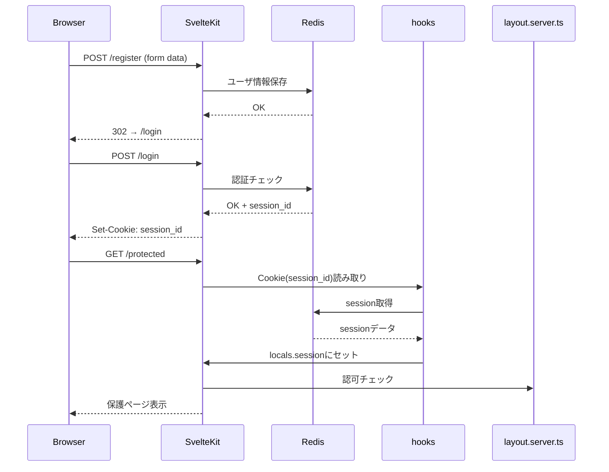
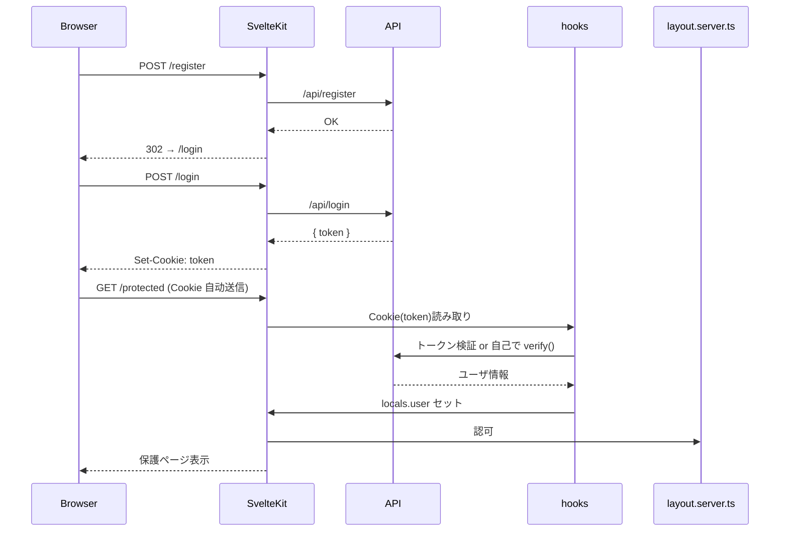

# SvelteKit におけるセッション管理まとめ

このページでは以下の内容を統合し、**ルートグループ `(auth)/` の仕組み**を活用した **認証フローのシーケンス図**も含めて丁寧に整理します。

* **ルートグループ `(auth)/` の仕組み**
* **SvelteKit のセッション管理（全体の概要）**
* **サーバーサイドセッション（Cookie + Redis 等）**
* **JWT ベースのセッション管理**


## 1. ルートグループ `(auth)/` の仕組み 🧩

* `()` で囲ったディレクトリは「URLに出ないフォルダー整理用グループ」です。
  例：

  ```
  src/routes/
  ├── (auth)/
  │   ├── login/     →  /login
  │   └── register/  →  /register
  └── +layout.svelte （全体の共通レイアウト）
  ```

* このグループに共通の `+layout.server.ts`（または `+layout.ts`）を置けば、
  認証チェック（ガード）や初期処理（例：ユーザー情報取得）をまとめて実行できます。


## 2. SvelteKit におけるセッション管理

SvelteKit にセッション管理の仕組みは組み込みでなく、**`hooks.server.ts` で処理し、`locals` に結果を格納するのが一般的**です。

* `cookies` や `Authorization` ヘッダーをパース
* JWT や session\_id の検証
* 検証結果（ユーザー情報など）を `event.locals` にセット
* 各 `load` 関数や `+server.ts`（API ハンドラ）で `locals` を利用して認証／ガード処理


## 3. サーバーサイドセッション（Cookie + Redis 等）

### 概要

* Cookie に `session_id` を HttpOnly／Secure 属性付きで保存
* Redis などサーバーサイドでデータを保持（ステートフル）
* `hooks.server.ts` で Cookie を読み、Redis からセッション情報を取得

### 実装サンプル

```ts
// hooks.server.ts
import cookie from 'cookie';
import { getSessionData } from '$lib/server/session-store';

export const handle: Handle = async ({ event, resolve }) => {
  const cookies = cookie.parse(event.request.headers.get('cookie') || '');
  const session = await getSessionData(cookies.session_id);
  event.locals.session = session;
  return resolve(event);
};
```

```ts
// routes/(auth)/+layout.server.ts
export const load: LayoutServerLoad = ({ locals, url }) => {
  if (!locals.session) throw redirect(302, `/login?redirectTo=${url.pathname}`);
  return { session: locals.session };
};
```

### シーケンス図：登録→ログイン→保護ページアクセス（サーバーセッション）




## 4. JWT ベースのセッション管理

### 概要

* JWT 本体を HttpOnly Cookie に保存 or クライアントで管理（Authorization ヘッダー）
* `hooks.server.ts` で JWT を検証し `locals.user` にユーザー情報をセット

### 実装サンプル

```ts
// hooks.server.ts
import { verify } from 'jsonwebtoken';

export const handle: Handle = async ({ event, resolve }) => {
  const auth = event.request.headers.get('authorization')?.slice(7);
  if (auth) {
    try {
      event.locals.user = verify(auth, JWT_SECRET);
    } catch {}
  }
  return resolve(event);
};
```

```ts
// routes/(auth)/+layout.server.ts
export const load: LayoutServerLoad = ({ locals, url }) => {
  if (!locals.user) throw redirect(302, `/login?redirectTo=${url.pathname}`);
  return { user: locals.user };
};
```

### シーケンス図：JWT 登録→ログイン→保護ページアクセス




## ✨ まとめ

* SSID（セッションID）方式も JWT 方式も、共通して `hooks.server.ts → locals → load/guard` の流れが基本です。
* `routes/(auth)/+layout.server.ts` を使うことで、**ログイン前アクセス制御（guard）** が簡潔に実装可能です。
* JWT はステートレスで拡張性・スケーラブルですが、Cookie 方式はサーバーでセッション一括管理・失効制御が可能です。
* プロジェクトの要件に応じて最適な方法を選択してください。


👋 ご希望であれば、「完全ソースコード例 + infra 設定」セットも提供可能です。お気軽にお知らせください。
