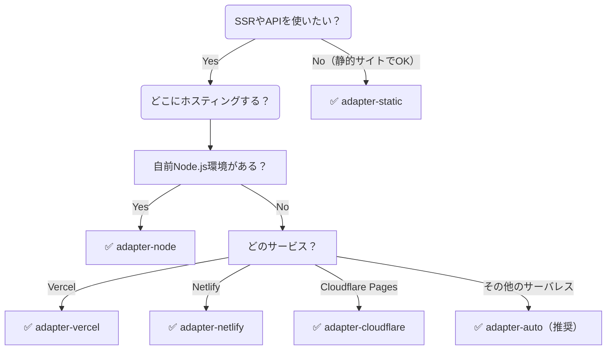

# SvelteKit Adapter 選定フローチャート

あなたのSvelteKitアプリはどこで・どう動かすのが最適か？  

## 🔀 フローチャート

## 🗂 選択肢まとめ

|Adapter|説明|用途例|
|---|---|---|
|adapter-static|静的HTML/JS/CSSで完結|ブログ、LP、ドキュメントサイト|
|adapter-node|Node.js サーバで稼働|VPS, EC2, Firebase Hosting with Functions|
|adapter-vercel|Vercel環境最適化|Vercel 公式推奨|
|adapter-netlify|Netlify専用機能対応|Netlify Forms, Redirectsなど|
|adapter-cloudflare|Cloudflare Pages + Workers 向け|Edge Functions環境|
|adapter-auto|多くの環境で自動選択|開発中の自動判別や汎用利用に便利|

## ✅ 例：よくある構成選び

|条件|選ぶAdapter|
|---|---|
|全ページを静的にしたい|adapter-static|
|Node.jsサーバがすでにある|adapter-node|
|無料・高速・簡単に使いたい|adapter-vercel or adapter-netlify|
|Edge Functionsで低レイテンシ|adapter-cloudflare|
|どれ使えばいいか迷ってる|adapter-auto（開発には最適）|

## 🔚 まとめ
- SvelteKit は 1つのコードで多様な配信方法を実現。
- アプリの性質・運用環境に応じて adapter-* を柔軟に選びましょう。
- 必要なら vite.config.js や hooks.server.ts で高度な制御も可能です。
