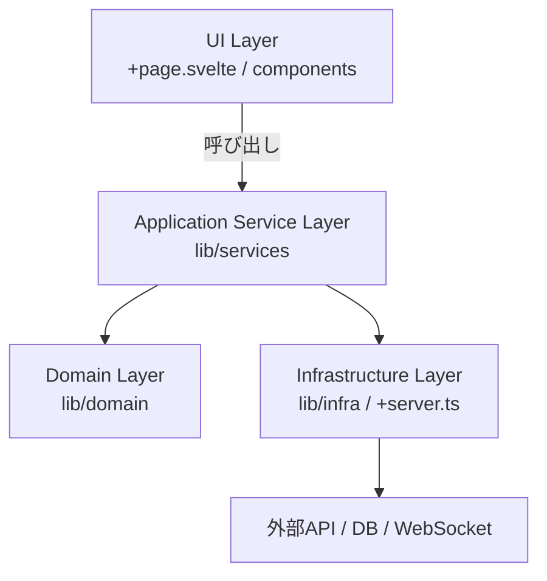
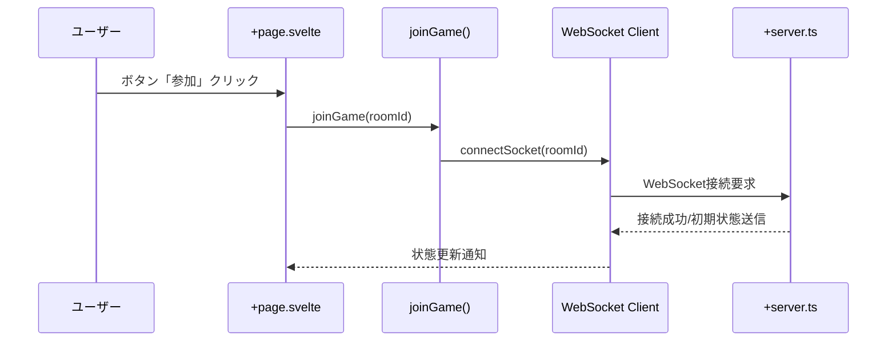

# SvelteKit におけるレイヤードアーキテクチャ対応のイメージ

SvelteKit はフロントエンドフレームワークですが、バックエンドでのレイヤードアーキテクチャ（Layered Architecture）や DDD の原則に近い構成を再現することが可能です。

ここでは、構造例とともに、従来のフロントエンド＋WebAPI構成との違いも解説します。

## 🧱 レイヤードアーキテクチャの基本構造（SvelteKit版）



- UI Layer: ユーザーとのインターフェース（ページ、入力フォームなど）
- Service Layer: アプリのユースケース処理
- Domain Layer: ビジネスロジック、エンティティ、集約など
- Infrastructure Layer: API通信や外部サービスへのアクセス

## 🧭 SvelteKitルート構成例

```
src/
├── routes/
│   ├── +page.svelte         # UI
│   ├── +server.ts           # APIエンドポイント (Infra)
├── lib/
│   ├── components/          # UIパーツ
│   ├── stores/              # 状態共有
│   ├── services/            # アプリケーションサービス
│   ├── domain/              # ドメインモデル・ビジネスルール
│   └── infra/               # 外部接続 (fetch, socket)
```

### 📂 各ファイルの役割まとめ（MPA構成に不慣れな方向け）

| ファイル名 | 役割 | 実行タイミング | 主な用途 |
|------------|------|----------------|----------|
| `+page.svelte` | ページのUIコンポーネント | クライアント／サーバ | 見た目やユーザインタフェース |
| `+page.ts` | ページのクライアント側ロジック（`load()`など） | クライアントのみ | クライアント状態やデータ取得（SPA風） |
| `+page.server.ts` | ページのサーバ側ロジック（`load()`や `actions`） | サーバのみ | 認証・DBアクセス・フォーム処理など |
| `+layout.svelte` | 共通レイアウト・ナビゲーションなど | クライアント／サーバ | 複数ページ間のレイアウト共通化 |

> `+page.svelte` は見た目、`+page.ts` / `+page.server.ts` はそれぞれクライアント／サーバでのロジック、`+layout.svelte` はサイト全体の枠組みです。

## 🔁 従来のSPA + WebAPI構成との違い

|比較軸|従来のSPA + WebAPI構成|SvelteKitのレイヤード構成|
|---|---|---|
|フロントとAPI|完全に分離（CORS, REST）|+server.ts で統合管理可能|
|SSR|ほぼ使わない（SPAのみ）|SSR/SSG も自然に対応|
|通信|fetch/axios 経由|load() / form action 経由|
|状態管理|クライアントのみで完結|サーバ/クライアントで分担可能|
|テスト対象の分離|クライアント/サーバ別個|構造化により統一的に扱える|


## 📡 シーケンス図：ジャンケン開始時の例



## 🏗 保守性・スケーラビリティの観点からの構成比較

中〜大規模アプリになると、UIとバックエンドの役割分離が重要になります。SvelteKitの統合構成と、伝統的なバックエンド分離構成を比較すると以下の通りです。

| 比較軸 | SvelteKit統合構成 | UI/API分離構成（SPA + RESTなど） |
|--------|-------------------|------------------------------|
| チーム分担 | フルスタック開発者向き | UI/バックエンドを分業しやすい |
| デプロイ | 一体デプロイ | 層ごとに分離・独立デプロイ可能 |
| セキュリティ設計 | 単一アプリで制御（認可も一体） | API境界で責務分離しやすい |
| スケーラビリティ | SvelteKitアプリ全体をスケール | APIのみ個別スケール可能 |
| 他クライアント対応 | 基本Web想定（モバイルには弱い） | モバイル/CLI/他Webから共通APIを使える |
| 初期開発速度 | 高速（セットアップ少） | API別設計によりやや手間がかかる |
| 移行性 | 小規模〜中規模まで有効 | 大規模向けには段階的移行が望ましい |

> 🚩結論：SvelteKitは初期統合構成で高速に開発し、将来的にAPI層を分離できるように抽象層（lib/infra/api.ts など）を設けておくとスムーズです。

## ✅ まとめ
- SvelteKit は、UI層からインフラ層まで一貫した構造を実現できるモダンなフルスタックフレームワーク。
- レイヤーごとに lib/ ディレクトリを分割することで、DDDやクリーンアーキテクチャの思想に近い設計が可能。
- WebAPIを別サービスにせず、+server.ts を活用することで、開発効率と構造の一体性を高められる。

実装初期からこの構造を意識すると、後のスケーラビリティやテスト性が格段に向上します。