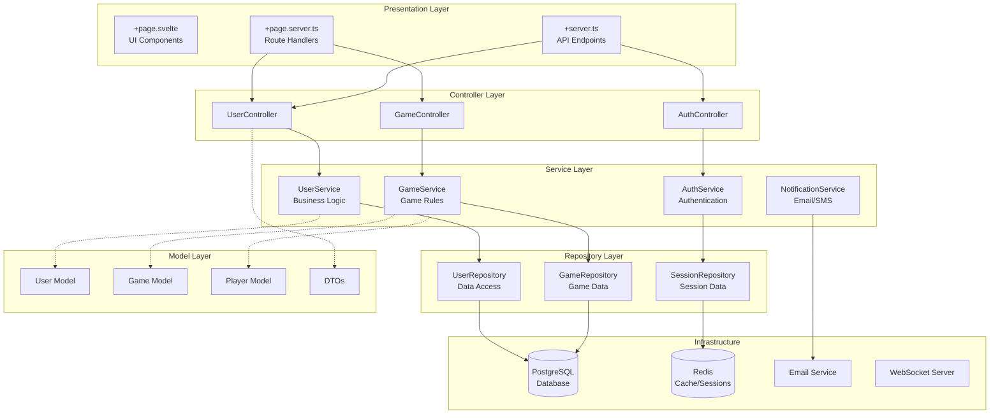

# Sveltekitとレイヤードアーキテクチャー

**SvelteKitでもレイヤードアーキテクチャーが使えます！** `+page.server.ts`はあくまで**コントローラー層**として薄く保ち、ビジネスロジックは別途分離するのがベストプラクティスです。


## SvelteKitバックエンドアーキテクチャ設計
### Svelteアーキテクチャ構成

```
/*
src/lib/server/
├── controllers/          # コントローラー層（薄い）
├── services/            # サービス層（ビジネスロジック）
├── repositories/        # リポジトリ層（データアクセス）
├── models/              # ドメインモデル
├── dto/                 # データ転送オブジェクト
├── validators/          # バリデーション
├── middlewares/         # ミドルウェア
├── database/            # DB接続・マイグレーション
└── config/              # 設定
*/

```

### 1. モデル層（Domain Models）

```ts
// src/lib/server/models/User.ts
export interface User {
  id: string;
  email: string;
  name: string;
  passwordHash: string;
  createdAt: Date;
  updatedAt: Date;
  isActive: boolean;
}

export interface CreateUserRequest {
  email: string;
  name: string;
  password: string;
}

export interface UpdateUserRequest {
  name?: string;
  email?: string;
}

// src/lib/server/models/Game.ts
export interface GameRoom {
  id: string;
  createdBy: string;
  maxPlayers: number;
  totalRounds: number;
  players: Player[];
  currentRound: number;
  status: GameStatus;
  createdAt: Date;
  expiresAt: Date;
}

export type GameStatus = 'waiting' | 'ready' | 'playing' | 'finished';

export interface Player {
  id: string;
  name: string;
  userId?: string;
  choice?: Choice;
  isReady: boolean;
  wins: number;
}

export type Choice = 'rock' | 'paper' | 'scissors';
```

### 2. リポジトリ層（Data Access）

```ts
// src/lib/server/repositories/UserRepository.ts
import type { User, CreateUserRequest, UpdateUserRequest } from '../models/User';
import { db } from '../database/connection';

export class UserRepository {
  async findById(id: string): Promise<User | null> {
    const result = await db.query(
      'SELECT * FROM users WHERE id = $1 AND is_active = true',
      [id]
    );
    return result.rows[0] || null;
  }

  async findByEmail(email: string): Promise<User | null> {
    const result = await db.query(
      'SELECT * FROM users WHERE email = $1 AND is_active = true',
      [email]
    );
    return result.rows[0] || null;
  }

  async create(userData: CreateUserRequest & { passwordHash: string }): Promise<User> {
    const result = await db.query(`
      INSERT INTO users (email, name, password_hash, created_at, updated_at, is_active)
      VALUES ($1, $2, $3, NOW(), NOW(), true)
      RETURNING *
    `, [userData.email, userData.name, userData.passwordHash]);
    
    return result.rows[0];
  }

  async update(id: string, userData: UpdateUserRequest): Promise<User | null> {
    const setClauses: string[] = [];
    const values: any[] = [];
    let paramCount = 1;

    if (userData.name) {
      setClauses.push(`name = $${paramCount++}`);
      values.push(userData.name);
    }
    
    if (userData.email) {
      setClauses.push(`email = $${paramCount++}`);
      values.push(userData.email);
    }

    if (setClauses.length === 0) return null;

    setClauses.push(`updated_at = NOW()`);
    values.push(id);

    const result = await db.query(`
      UPDATE users 
      SET ${setClauses.join(', ')} 
      WHERE id = $${paramCount} AND is_active = true
      RETURNING *
    `, values);

    return result.rows[0] || null;
  }

  async softDelete(id: string): Promise<boolean> {
    const result = await db.query(
      'UPDATE users SET is_active = false, updated_at = NOW() WHERE id = $1',
      [id]
    );
    return result.rowCount > 0;
  }
}
```
```ts
// src/lib/server/repositories/GameRepository.ts
import type { GameRoom, Player } from '../models/Game';
import { db } from '../database/connection';

export class GameRepository {
  async findById(id: string): Promise<GameRoom | null> {
    const result = await db.query(`
      SELECT g.*, 
        json_agg(
          json_build_object(
            'id', p.id,
            'name', p.name,
            'userId', p.user_id,
            'choice', p.choice,
            'isReady', p.is_ready,
            'wins', p.wins
          )
        ) as players
      FROM game_rooms g
      LEFT JOIN players p ON g.id = p.game_room_id
      WHERE g.id = $1 AND g.expires_at > NOW()
      GROUP BY g.id
    `, [id]);
    
    return result.rows[0] || null;
  }

  async create(gameData: Omit<GameRoom, 'id' | 'players' | 'createdAt' | 'expiresAt'>): Promise<GameRoom> {
    const result = await db.query(`
      INSERT INTO game_rooms (
        created_by, max_players, total_rounds, current_round, status, 
        created_at, expires_at
      )
      VALUES ($1, $2, $3, $4, $5, NOW(), NOW() + INTERVAL '5 days')
      RETURNING *
    `, [
      gameData.createdBy,
      gameData.maxPlayers,
      gameData.totalRounds,
      gameData.currentRound,
      gameData.status
    ]);

    return { ...result.rows[0], players: [] };
  }

  async addPlayer(gameId: string, player: Omit<Player, 'wins'>): Promise<Player> {
    const result = await db.query(`
      INSERT INTO players (id, game_room_id, name, user_id, is_ready, wins)
      VALUES ($1, $2, $3, $4, $5, 0)
      RETURNING *
    `, [player.id, gameId, player.name, player.userId, player.isReady]);

    return result.rows[0];
  }
}
```

### 3. サービス層（Business Logic）

```ts
// src/lib/server/services/UserService.ts
import bcrypt from 'bcryptjs';
import jwt from 'jsonwebtoken';
import type { User, CreateUserRequest, UpdateUserRequest } from '../models/User';
import { UserRepository } from '../repositories/UserRepository';
import { UserValidator } from '../validators/UserValidator';
import { AppError } from '../utils/AppError';

export class UserService {
  private userRepository: UserRepository;
  private validator: UserValidator;

  constructor() {
    this.userRepository = new UserRepository();
    this.validator = new UserValidator();
  }

  async createUser(userData: CreateUserRequest): Promise<User> {
    // バリデーション
    const validationResult = this.validator.validateCreateUser(userData);
    if (!validationResult.isValid) {
      throw new AppError('Validation failed', 400, validationResult.errors);
    }

    // 重複チェック
    const existingUser = await this.userRepository.findByEmail(userData.email);
    if (existingUser) {
      throw new AppError('Email already exists', 409);
    }

    // パスワードハッシュ化
    const passwordHash = await bcrypt.hash(userData.password, 12);

    // ユーザー作成
    const user = await this.userRepository.create({
      ...userData,
      passwordHash
    });

    return user;
  }

  async authenticateUser(email: string, password: string): Promise<{ user: User; token: string }> {
    const user = await this.userRepository.findByEmail(email);
    if (!user) {
      throw new AppError('Invalid credentials', 401);
    }

    const isPasswordValid = await bcrypt.compare(password, user.passwordHash);
    if (!isPasswordValid) {
      throw new AppError('Invalid credentials', 401);
    }

    const token = jwt.sign(
      { userId: user.id, email: user.email },
      process.env.JWT_SECRET!,
      { expiresIn: '24h' }
    );

    return { user, token };
  }

  async updateUser(id: string, userData: UpdateUserRequest): Promise<User> {
    const validationResult = this.validator.validateUpdateUser(userData);
    if (!validationResult.isValid) {
      throw new AppError('Validation failed', 400, validationResult.errors);
    }

    const user = await this.userRepository.update(id, userData);
    if (!user) {
      throw new AppError('User not found', 404);
    }

    return user;
  }

  async getUserById(id: string): Promise<User> {
    const user = await this.userRepository.findById(id);
    if (!user) {
      throw new AppError('User not found', 404);
    }
    return user;
  }
}
```
```ts
// src/lib/server/services/GameService.ts
import type { GameRoom, Player, Choice } from '../models/Game';
import { GameRepository } from '../repositories/GameRepository';
import { AppError } from '../utils/AppError';
import { v4 as uuidv4 } from 'uuid';

export class GameService {
  private gameRepository: GameRepository;

  constructor() {
    this.gameRepository = new GameRepository();
  }

  async createGame(createdBy: string, maxPlayers: number, totalRounds: number): Promise<GameRoom> {
    if (maxPlayers < 2 || maxPlayers > 10) {
      throw new AppError('Invalid player count', 400);
    }

    if (totalRounds < 1 || totalRounds > 100) {
      throw new AppError('Invalid round count', 400);
    }

    const gameData = {
      createdBy,
      maxPlayers,
      totalRounds,
      currentRound: 0,
      status: 'waiting' as const
    };

    return await this.gameRepository.create(gameData);
  }

  async joinGame(gameId: string, playerName: string, userId?: string): Promise<GameRoom> {
    const game = await this.gameRepository.findById(gameId);
    if (!game) {
      throw new AppError('ゲームが見つかりません', 404);
    }

    if (game.status !== 'waiting') {
      throw new AppError('ゲーム参加は終了しています', 400);
    }

    if (game.players.length >= game.maxPlayers) {
      throw new AppError('参加者が満員です', 400);
    }

    const player: Omit<Player, 'wins'> = {
      id: uuidv4(),
      name: playerName,
      userId,
      isReady: false
    };

    await this.gameRepository.addPlayer(gameId, player);
    
    // 更新されたゲーム情報を取得
    return await this.gameRepository.findById(gameId);
  }

  determineWinner(choices: Record<string, Choice>): string[] {
    const playerIds = Object.keys(choices);
    const choiceValues = Object.values(choices);
    
    // 全員同じ選択の場合は引き分け
    if (new Set(choiceValues).size === 1) {
      return [];
    }
    
    // 勝利判定ロジック
    const wins: Record<Choice, Choice> = {
      rock: 'scissors',
      scissors: 'paper',
      paper: 'rock'
    };
    
    const winners: string[] = [];
    
    for (const [playerId, choice] of Object.entries(choices)) {
      const beatenChoice = wins[choice];
      const hasBeatenChoice = choiceValues.includes(beatenChoice);
      const hasBeatingChoice = choiceValues.some(c => wins[c] === choice);
      
      if (hasBeatenChoice && !hasBeatingChoice) {
        winners.push(playerId);
      }
    }
    
    return winners;
  }
}
```

### 4. バリデーター層

```ts
// src/lib/server/validators/UserValidator.ts
import type { CreateUserRequest, UpdateUserRequest } from '../models/User';

export interface ValidationResult {
  isValid: boolean;
  errors: string[];
}

export class UserValidator {
  validateCreateUser(userData: CreateUserRequest): ValidationResult {
    const errors: string[] = [];

    if (!userData.email || !this.isValidEmail(userData.email)) {
      errors.push('有効なメールアドレスを入力してください');
    }

    if (!userData.name || userData.name.length < 2) {
      errors.push('名前は2文字以上である必要があります');
    }

    if (!userData.password || userData.password.length < 8) {
      errors.push('パスワードは8文字以上である必要があります');
    }

    return {
      isValid: errors.length === 0,
      errors
    };
  }

  validateUpdateUser(userData: UpdateUserRequest): ValidationResult {
    const errors: string[] = [];

    if (userData.email && !this.isValidEmail(userData.email)) {
      errors.push('有効なメールアドレスを入力してください');
    }

    if (userData.name && userData.name.length < 2) {
      errors.push('名前は2文字以上である必要があります');
    }

    return {
      isValid: errors.length === 0,
      errors
    };
  }

  private isValidEmail(email: string): boolean {
    const emailRegex = /^[^\s@]+@[^\s@]+\.[^\s@]+$/;
    return emailRegex.test(email);
  }
}
```
### 5. コントローラー層（薄い層）

```ts
// src/lib/server/controllers/UserController.ts
import type { RequestEvent } from '@sveltejs/kit';
import { UserService } from '../services/UserService';
import { AppError } from '../utils/AppError';

export class UserController {
  private userService: UserService;

  constructor() {
    this.userService = new UserService();
  }

  async createUser(event: RequestEvent) {
    try {
      const formData = await event.request.formData();
      const userData = {
        email: formData.get('email') as string,
        name: formData.get('name') as string,
        password: formData.get('password') as string
      };

      const user = await this.userService.createUser(userData);
      
      return {
        success: true,
        user: {
          id: user.id,
          name: user.name,
          email: user.email
        }
      };
    } catch (error) {
      if (error instanceof AppError) {
        return {
          success: false,
          error: error.message,
          statusCode: error.statusCode
        };
      }
      throw error;
    }
  }

  async updateUser(event: RequestEvent, userId: string) {
    try {
      const formData = await event.request.formData();
      const userData = {
        name: formData.get('name') as string || undefined,
        email: formData.get('email') as string || undefined
      };

      const user = await this.userService.updateUser(userId, userData);
      
      return {
        success: true,
        user: {
          id: user.id,
          name: user.name,
          email: user.email
        }
      };
    } catch (error) {
      if (error instanceof AppError) {
        return {
          success: false,
          error: error.message,
          statusCode: error.statusCode
        };
      }
      throw error;
    }
  }
}
```


### 6. エラーハンドリング

```
// src/lib/server/utils/AppError.ts
export class AppError extends Error {
  public readonly statusCode: number;
  public readonly details?: any;

  constructor(message: string, statusCode: number = 500, details?: any) {
    super(message);
    this.statusCode = statusCode;
    this.details = details;
    this.name = 'AppError';
  }
}
```

### 7. +page.server.ts での使用（薄いコントローラー）
```ts
// src/routes/profile/+page.server.ts
import type { PageServerLoad, Actions } from './$types';
import { error, fail } from '@sveltejs/kit';
import { UserController } from '$lib/server/controllers/UserController';
import { UserService } from '$lib/server/services/UserService';

const userController = new UserController();
const userService = new UserService();

export const load: PageServerLoad = async ({ locals }) => {
  if (!locals.user) {
    throw error(401, 'ログインが必要です');
  }

  try {
    // サービス層を直接呼び出し（シンプルな場合）
    const user = await userService.getUserById(locals.user.id);
    
    return {
      user: {
        id: user.id,
        name: user.name,
        email: user.email,
        lastLogin: user.updatedAt
      }
    };
  } catch (err) {
    throw error(500, 'ユーザー情報の取得に失敗しました');
  }
};

export const actions: Actions = {
  updateProfile: async (event) => {
    // コントローラー層を使用
    const result = await userController.updateUser(event, event.locals.user.id);
    
    if (!result.success) {
      return fail(result.statusCode || 400, {
        error: result.error
      });
    }
    
    return { success: true };
  }
};
```

## アーキテクチャの全体像



## 💡 重要なポイント

### ✅ `+page.server.ts` の正しい使い方

```typescript
// ❌ 悪い例（すべてを1つのファイルに）
export const load = async ({ locals }) => {
  // 100行のビジネスロジック...
  // データベース操作...
  // バリデーション...
};

// ✅ 良い例（薄いコントローラー）
export const load = async ({ locals }) => {
  const userService = new UserService();
  return await userService.getUserProfile(locals.user.id);
};
```

### 🔄 .NET C# との比較

| .NET C# | SvelteKit | 役割 |
|---------|-----------|------|
| Controller | `+page.server.ts` + Controller | リクエスト処理 |
| Service | `src/lib/server/services/` | ビジネスロジック |
| Repository | `src/lib/server/repositories/` | データアクセス |
| Model/Entity | `src/lib/server/models/` | ドメインモデル |
| DTO | `src/lib/server/dto/` | データ転送 |

### 📁 推奨フォルダ構成

```
src/lib/server/
├── controllers/      # 薄いコントローラー
├── services/         # ビジネスロジック
├── repositories/     # データアクセス層
├── models/           # ドメインモデル
├── dto/              # DTO・API契約
├── validators/       # バリデーション
├── utils/            # ユーティリティ
├── database/         # DB関連
├── middleware/       # ミドルウェア
└── config/           # 設定
```

## 🔧 依存性注入（DI）の実装

SvelteKitには標準のDIコンテナはありませんが、簡単に実装できます：## 🧪 テスト戦略（Jasmineの経験を活かす）

Angular + Jasmineの経験をお持ちなら、SvelteKitでも同様のテスト戦略が使えます：## 🎯 まとめ

```ts
// src/lib/server/di/Container.ts
// シンプルなDIコンテナの実装

type Constructor<T = {}> = new (...args: any[]) => T;
type Factory<T> = () => T;

export class DIContainer {
  private services = new Map<string, any>();
  private singletons = new Map<string, any>();

  // サービス登録（トランジェント）
  register<T>(token: string, implementation: Constructor<T> | Factory<T>): void {
    this.services.set(token, implementation);
  }

  // シングルトン登録
  registerSingleton<T>(token: string, implementation: Constructor<T> | Factory<T>): void {
    this.services.set(token, implementation);
    this.singletons.set(token, null); // マーカー
  }

  // サービス解決
  resolve<T>(token: string): T {
    const implementation = this.services.get(token);
    if (!implementation) {
      throw new Error(`Service ${token} not registered`);
    }

    // シングルトンチェック
    if (this.singletons.has(token)) {
      let instance = this.singletons.get(token);
      if (!instance) {
        instance = typeof implementation === 'function' 
          ? new implementation() 
          : implementation();
        this.singletons.set(token, instance);
      }
      return instance;
    }

    // トランジェント
    return typeof implementation === 'function' 
      ? new implementation() 
      : implementation();
  }
}

// グローバルコンテナ
export const container = new DIContainer();
```
### サービス登録の設定

```ts
// src/lib/server/di/setup.ts
import { container } from './Container';
import { UserRepository } from '../repositories/UserRepository';
import { GameRepository } from '../repositories/GameRepository';
import { UserService } from '../services/UserService';
import { GameService } from '../services/GameService';
import { AuthService } from '../services/AuthService';

export function setupDI(): void {
  // リポジトリ（シングルトン）
  container.registerSingleton('UserRepository', UserRepository);
  container.registerSingleton('GameRepository', GameRepository);

  // サービス（シングルトン）
  container.registerSingleton('UserService', UserService);
  container.registerSingleton('GameService', GameService);
  container.registerSingleton('AuthService', AuthService);
}
```

### DIを使ったサービス実装

```ts
// src/lib/server/services/UserService.ts（DI版）
import type { UserRepository } from '../repositories/UserRepository';
import { container } from '../di/Container';

export class UserService {
  private userRepository: UserRepository;

  constructor() {
    // DIコンテナから依存関係を解決
    this.userRepository = container.resolve<UserRepository>('UserRepository');
  }

  async createUser(userData: CreateUserRequest): Promise<User> {
    // ビジネスロジック...
    return await this.userRepository.create(userData);
  }
}
```

### +page.server.ts での使用

```ts
// src/routes/+layout.server.ts（アプリ起動時にDI設定）
import { setupDI } from '$lib/server/di/setup';

// アプリ起動時に1回だけ実行
setupDI();

// src/routes/users/+page.server.ts
import type { PageServerLoad } from './$types';
import { container } from '$lib/server/di/Container';
import type { UserService } from '$lib/server/services/UserService';

export const load: PageServerLoad = async ({ locals }) => {
  const userService = container.resolve<UserService>('UserService');
  
  const users = await userService.getAllUsers();
  
  return { users };
};
```
### 高度なDI：インターフェース基盤

```ts
// src/lib/server/interfaces/IUserRepository.ts
export interface IUserRepository {
  findById(id: string): Promise<User | null>;
  create(userData: CreateUserRequest): Promise<User>;
  update(id: string, userData: UpdateUserRequest): Promise<User | null>;
}

// src/lib/server/repositories/UserRepository.ts（インターフェース実装）
import type { IUserRepository } from '../interfaces/IUserRepository';

export class UserRepository implements IUserRepository {
  async findById(id: string): Promise<User | null> {
    // 実装...
  }
  
  async create(userData: CreateUserRequest): Promise<User> {
    // 実装...
  }
  
  async update(id: string, userData: UpdateUserRequest): Promise<User | null> {
    // 実装...
  }
}

// テスト用モックリポジトリ
export class MockUserRepository implements IUserRepository {
  private users: User[] = [];
  
  async findById(id: string): Promise<User | null> {
    return this.users.find(u => u.id === id) || null;
  }
  
  async create(userData: CreateUserRequest): Promise<User> {
    const user: User = {
      id: Math.random().toString(),
      ...userData,
      passwordHash: 'hashed',
      createdAt: new Date(),
      updatedAt: new Date(),
      isActive: true
    };
    this.users.push(user);
    return user;
  }
  
  async update(id: string, userData: UpdateUserRequest): Promise<User | null> {
    const index = this.users.findIndex(u => u.id === id);
    if (index === -1) return null;
    
    this.users[index] = { ...this.users[index], ...userData, updatedAt: new Date() };
    return this.users[index];
  }
}

// DI設定（環境別）
// src/lib/server/di/setup.ts
export function setupDI(): void {
  if (process.env.NODE_ENV === 'test') {
    // テスト環境ではモックを使用
    container.registerSingleton('UserRepository', MockUserRepository);
  } else {
    // 本番環境では実際のリポジトリを使用
    container.registerSingleton('UserRepository', UserRepository);
  }
  
  container.registerSingleton('UserService', UserService);
}
```
### ファクトリーパターンの実装

```ts
// src/lib/server/factories/ServiceFactory.ts
export class ServiceFactory {
  static createUserService(): UserService {
    return container.resolve<UserService>('UserService');
  }
  
  static createGameService(): GameService {
    return container.resolve<GameService>('GameService');
  }
  
  static createAuthService(): AuthService {
    return container.resolve<AuthService>('AuthService');
  }
}

// 使用例
// src/routes/api/users/+server.ts
import { ServiceFactory } from '$lib/server/factories/ServiceFactory';

export async function GET() {
  const userService = ServiceFactory.createUserService();
  const users = await userService.getAllUsers();
  
  return new Response(JSON.stringify(users));
}
```

## テスト戦略


### テスト環境設定

```ts
// vitest.config.ts
import { defineConfig } from 'vitest/config';
import { sveltekit } from '@sveltejs/kit/vite';

export default defineConfig({
  plugins: [sveltekit()],
  test: {
    environment: 'jsdom',
    globals: true,
    setupFiles: ['src/test/setup.ts']
  }
});
```

```ts
// src/test/setup.ts
import '@testing-library/jest-dom';
import { vi } from 'vitest';

// グローバルモック
global.fetch = vi.fn();
```

### リポジトリ層のテスト
```ts
// src/lib/server/repositories/__tests__/UserRepository.test.ts
import { describe, it, expect, beforeEach, vi } from 'vitest';
import { UserRepository } from '../UserRepository';
import type { CreateUserRequest } from '../../models/User';

// DBモック
vi.mock('../../database/connection', () => ({
  db: {
    query: vi.fn()
  }
}));

import { db } from '../../database/connection';

describe('UserRepository', () => {
  let userRepository: UserRepository;
  const mockDb = vi.mocked(db);

  beforeEach(() => {
    userRepository = new UserRepository();
    vi.clearAllMocks();
  });

  describe('findById', () => {
    it('should return user when found', async () => {
      // Arrange
      const userId = 'user-123';
      const mockUser = {
        id: userId,
        name: 'Test User',
        email: 'test@example.com',
        password_hash: 'hashed',
        created_at: new Date(),
        updated_at: new Date(),
        is_active: true
      };

      mockDb.query.mockResolvedValue({ rows: [mockUser] });

      // Act
      const result = await userRepository.findById(userId);

      // Assert
      expect(result).toEqual(mockUser);
      expect(mockDb.query).toHaveBeenCalledWith(
        'SELECT * FROM users WHERE id = $1 AND is_active = true',
        [userId]
      );
    });

    it('should return null when user not found', async () => {
      // Arrange
      mockDb.query.mockResolvedValue({ rows: [] });

      // Act
      const result = await userRepository.findById('nonexistent');

      // Assert
      expect(result).toBeNull();
    });
  });

  describe('create', () => {
    it('should create user successfully', async () => {
      // Arrange
      const userData: CreateUserRequest & { passwordHash: string } = {
        email: 'new@example.com',
        name: 'New User',
        password: 'password123',
        passwordHash: 'hashed-password'
      };

      const mockCreatedUser = {
        id: 'new-user-id',
        ...userData,
        created_at: new Date(),
        updated_at: new Date(),
        is_active: true
      };

      mockDb.query.mockResolvedValue({ rows: [mockCreatedUser] });

      // Act
      const result = await userRepository.create(userData);

      // Assert
      expect(result).toEqual(mockCreatedUser);
      expect(mockDb.query).toHaveBeenCalledWith(
        expect.stringContaining('INSERT INTO users'),
        [userData.email, userData.name, userData.passwordHash]
      );
    });
  });
});
```
### サービス層のテスト

```ts
// src/lib/server/services/__tests__/UserService.test.ts
import { describe, it, expect, beforeEach, vi } from 'vitest';
import { UserService } from '../UserService';
import { UserRepository } from '../../repositories/UserRepository';
import { UserValidator } from '../../validators/UserValidator';
import { AppError } from '../../utils/AppError';
import type { CreateUserRequest } from '../../models/User';

// 依存関係をモック
vi.mock('../../repositories/UserRepository');
vi.mock('../../validators/UserValidator');
vi.mock('bcryptjs', () => ({
  hash: vi.fn().mockResolvedValue('hashed-password')
}));

describe('UserService', () => {
  let userService: UserService;
  let mockUserRepository: vi.Mocked<UserRepository>;
  let mockValidator: vi.Mocked<UserValidator>;

  beforeEach(() => {
    mockUserRepository = vi.mocked(new UserRepository());
    mockValidator = vi.mocked(new UserValidator());
    
    userService = new UserService();
    // プライベートプロパティのモック注入
    (userService as any).userRepository = mockUserRepository;
    (userService as any).validator = mockValidator;
  });

  describe('createUser', () => {
    const validUserData: CreateUserRequest = {
      email: 'test@example.com',
      name: 'Test User',
      password: 'password123'
    };

    it('should create user successfully', async () => {
      // Arrange
      mockValidator.validateCreateUser.mockReturnValue({
        isValid: true,
        errors: []
      });
      
      mockUserRepository.findByEmail.mockResolvedValue(null);
      mockUserRepository.create.mockResolvedValue({
        id: 'user-123',
        email: validUserData.email,
        name: validUserData.name,
        passwordHash: 'hashed-password',
        createdAt: new Date(),
        updatedAt: new Date(),
        isActive: true
      });

      // Act
      const result = await userService.createUser(validUserData);

      // Assert
      expect(result).toBeDefined();
      expect(result.email).toBe(validUserData.email);
      expect(mockValidator.validateCreateUser).toHaveBeenCalledWith(validUserData);
      expect(mockUserRepository.findByEmail).toHaveBeenCalledWith(validUserData.email);
      expect(mockUserRepository.create).toHaveBeenCalledWith({
        ...validUserData,
        passwordHash: 'hashed-password'
      });
    });

    it('should throw validation error for invalid data', async () => {
      // Arrange
      mockValidator.validateCreateUser.mockReturnValue({
        isValid: false,
        errors: ['Invalid email']
      });

      // Act & Assert
      await expect(userService.createUser(validUserData))
        .rejects.toThrow(AppError);
      
      expect(mockUserRepository.findByEmail).not.toHaveBeenCalled();
    });

    it('should throw error when email already exists', async () => {
      // Arrange
      mockValidator.validateCreateUser.mockReturnValue({
        isValid: true,
        errors: []
      });
      
      mockUserRepository.findByEmail.mockResolvedValue({
        id: 'existing-user',
        email: validUserData.email,
        name: 'Existing User',
        passwordHash: 'hash',
        createdAt: new Date(),
        updatedAt: new Date(),
        isActive: true
      });

      // Act & Assert
      await expect(userService.createUser(validUserData))
        .rejects.toThrow('Email already exists');
    });
  });
});
```
### コンポーネントのテスト
```ts
// src/lib/components/__tests__/GameRoom.test.ts
import { describe, it, expect, vi } from 'vitest';
import { render, screen, fireEvent } from '@testing-library/svelte';
import GameRoom from '../GameRoom.svelte';
import type { GameRoom as GameRoomType } from '$lib/server/models/Game';

describe('GameRoom Component', () => {
  const mockGameRoom: GameRoomType = {
    id: 'room-123',
    createdBy: 'user-1',
    maxPlayers: 4,
    totalRounds: 3,
    players: [
      { id: 'player-1', name: 'Player 1', isReady: false, wins: 0 },
      { id: 'player-2', name: 'Player 2', isReady: true, wins: 1 }
    ],
    currentRound: 1,
    status: 'waiting',
    createdAt: new Date(),
    expiresAt: new Date()
  };

  it('should display game room information', () => {
    // Act
    render(GameRoom, { props: { gameRoom: mockGameRoom } });

    // Assert
    expect(screen.getByText('ルーム: room-123')).toBeInTheDocument();
    expect(screen.getByText('参加者: 2/4')).toBeInTheDocument();
    expect(screen.getByText('Player 1')).toBeInTheDocument();
    expect(screen.getByText('Player 2')).toBeInTheDocument();
  });

  it('should show ready status for players', () => {
    // Act
    render(GameRoom, { props: { gameRoom: mockGameRoom } });

    // Assert
    expect(screen.getByText('未準備')).toBeInTheDocument(); // Player 1
    expect(screen.getByText('準備完了')).toBeInTheDocument(); // Player 2
  });

  it('should emit ready event when ready button clicked', async () => {
    // Arrange
    const { component } = render(GameRoom, { props: { gameRoom: mockGameRoom } });
    let readyEventFired = false;
    
    component.$on('ready', () => {
      readyEventFired = true;
    });

    // Act
    const readyButton = screen.getByRole('button', { name: '準備完了' });
    await fireEvent.click(readyButton);

    // Assert
    expect(readyEventFired).toBe(true);
  });
});
```
### API エンドポイントのテスト

```ts
// src/routes/api/users/__tests__/+server.test.ts
import { describe, it, expect, vi } from 'vitest';
import { GET, POST } from '../+server.js';
import type { RequestEvent } from '@sveltejs/kit';

// サービスモック
vi.mock('$lib/server/services/UserService', () => ({
  UserService: vi.fn().mockImplementation(() => ({
    getAllUsers: vi.fn(),
    createUser: vi.fn()
  }))
}));

describe('/api/users', () => {
  describe('GET', () => {
    it('should return users list', async () => {
      // Arrange
      const mockUsers = [
        { id: '1', name: 'User 1', email: 'user1@example.com' },
        { id: '2', name: 'User 2', email: 'user2@example.com' }
      ];

      const mockUserService = {
        getAllUsers: vi.fn().mockResolvedValue(mockUsers)
      };
      
      vi.mocked(UserService).mockImplementation(() => mockUserService as any);

      const mockEvent = {} as RequestEvent;

      // Act
      const response = await GET(mockEvent);
      const data = await response.json();

      // Assert
      expect(response.status).toBe(200);
      expect(data).toEqual(mockUsers);
    });
  });

  describe('POST', () => {
    it('should create user successfully', async () => {
      // Arrange
      const newUser = { id: '3', name: 'New User', email: 'new@example.com' };
      const mockUserService = {
        createUser: vi.fn().mockResolvedValue(newUser)
      };
      
      vi.mocked(UserService).mockImplementation(() => mockUserService as any);

      const mockFormData = new FormData();
      mockFormData.append('name', 'New User');
      mockFormData.append('email', 'new@example.com');
      mockFormData.append('password', 'password123');

      const mockRequest = {
        formData: vi.fn().mockResolvedValue(mockFormData)
      };

      const mockEvent = { request: mockRequest } as any;

      // Act
      const response = await POST(mockEvent);
      const data = await response.json();

      // Assert
      expect(response.status).toBe(201);
      expect(data).toEqual(newUser);
    });
  });
});
```

### テストスイート実行コマンド

```json
// package.json:
{
  "scripts": {
    "test": "vitest",
    "test:ui": "vitest --ui",
    "test:coverage": "vitest --coverage",
    "test:watch": "vitest --watch"
  }
}
```

#### 実行コマンド
```
npm run test                # 全テスト実行
npm run test:watch         # ウォッチモード
npm run test:coverage      # カバレッジレポート
npm run test UserService   # 特定のテストファイル実行
```


## 答え：SvelteKitでも完全に従来のアーキテクチャが使えます！

### ✅ 重要なポイント

1. **`+page.server.ts`は薄いコントローラー層として使う**
2. **ビジネスロジックは`src/lib/server/`以下に分離**
3. **Repository → Service → Controller の責任分離**
4. **依存性注入もテストも従来通り**

### 🔄 .NET C# との対応関係

```csharp
// .NET C# での構成
Controllers/UserController.cs     → +page.server.ts (薄く)
Services/UserService.cs          → src/lib/server/services/
Repositories/UserRepository.cs   → src/lib/server/repositories/
Models/User.cs                   → src/lib/server/models/
```

### 📦 実際のプロジェクト構成例

```
src/lib/server/
├── controllers/       # 薄いコントローラー
├── services/          # ビジネスロジック（.NET Service層と同じ）
├── repositories/      # データアクセス（.NET Repository層と同じ）
├── models/           # ドメインモデル（.NET Model層と同じ）
├── validators/       # バリデーション（.NET ModelState的な）
└── di/               # 依存性注入（.NET DIコンテナ的な）
```
