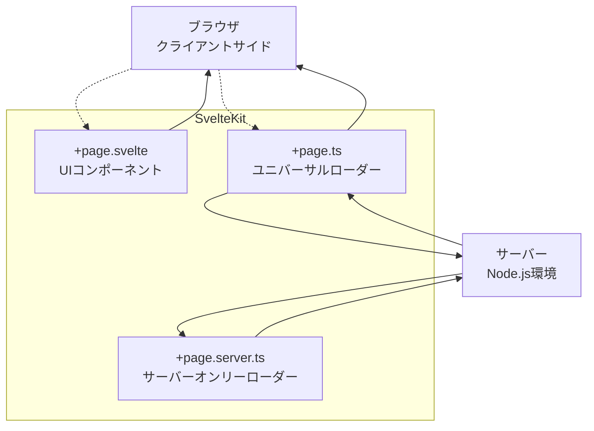
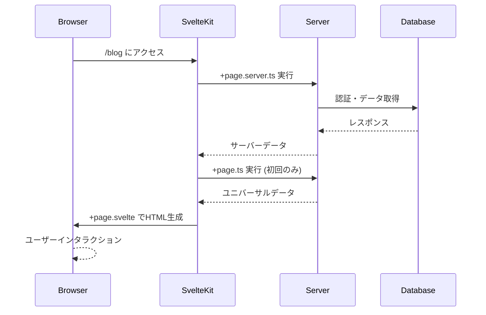

# SvelteKit ファイル構成の役割と実行環境

## 🌐 実行環境の理解



## 📁 各ファイルの役割

### `+page.svelte` - UIコンポーネント（フロントエンド）

- **実行環境**: ブラウザ  
- **役割**: UIの描画とユーザーインタラクション  
- **Angular類似**: Component + Template

```typescript
<!-- src/routes/blog/+page.svelte -->
<script lang="ts">
  // この部分はブラウザで実行される
  import type { PageData } from './$types';
  
  export let data: PageData; // ローダーからのデータを受け取る
  
  let selectedPost = $state(data.posts[0]);
  
  function selectPost(post: Post) {
    selectedPost = post;
  }
</script>

<h1>ブログ一覧</h1>
<div class="posts">
  {#each data.posts as post}
    <article class:selected={post === selectedPost}>
      <h2>{post.title}</h2>
      <p>{post.excerpt}</p>
      <button onclick={() => selectPost(post)}>選択</button>
    </article>
  {/each}
</div>

<style>
  .selected { border: 2px solid blue; }
</style>
```

### `+page.ts` - ユニバーサルローダー（両方）

- **実行環境**: サーバー（初回） + ブラウザ（以降のナビゲーション）  
- **役割**: 公開データの取得、キャッシュ可能なデータ  
- **Angular類似**: Resolver + HTTP Interceptor

```typescript
// src/routes/blog/+page.ts
import type { PageLoad } from './$types';

export const load: PageLoad = async ({ fetch, params, url }) => {
  // ⚠️ この関数は「サーバー」と「ブラウザ」両方で実行される！
  
  // 初回アクセス: サーバーで実行 → HTMLにデータを埋め込み
  // ページ遷移時: ブラウザで実行 → JSONでデータを取得
  
  const limit = url.searchParams.get('limit') || '10';
  
  // fetchは自動的にサーバー/クライアントを判別
  const response = await fetch(`/api/posts?limit=${limit}`);
  const posts = await response.json();
  
  return {
    posts,
    limit: Number(limit)
  };
};

// ページオプション
export const prerender = false; // 静的生成しない
export const ssr = true;        // サーバーサイドレンダリング有効
export const csr = true;        // クライアントサイドレンダリング有効
```

### `+page.server.ts` - サーバーオンリーローダー（バックエンド）
- **実行環境**: サーバーのみ  
- **役割**: 秘密情報、データベース直接アクセス、認証  
- **Angular類似**: Backend API Controller

```typescript
// src/routes/blog/+page.server.ts
import type { PageServerLoad } from './$types';
import { error, redirect } from '@sveltejs/kit';
import { db } from '$lib/server/database';

export const load: PageServerLoad = async ({ locals, cookies, params, request }) => {
  // 🔒 この関数は「サーバーでのみ」実行される！
  // ブラウザからは見えない、秘密の処理が可能
  
  // 認証チェック
  if (!locals.user) {
    throw redirect(302, '/login');
  }
  
  // データベース直接アクセス
  try {
    const posts = await db.query(`
      SELECT * FROM posts 
      WHERE author_id = $1 
      AND status = 'published'
      ORDER BY created_at DESC
    `, [locals.user.id]);
    
    // 秘密情報（APIキーなど）の使用
    const analytics = await fetch('https://api.private.com/analytics', {
      headers: {
        'Authorization': `Bearer ${process.env.SECRET_API_KEY}` // 🔐 環境変数
      }
    });
    
    return {
      posts,
      analytics: await analytics.json(),
      user: {
        id: locals.user.id,
        name: locals.user.name
        // パスワードなどの秘密情報は返さない
      }
    };
    
  } catch (e) {
    console.error('Database error:', e);
    throw error(500, 'データの取得に失敗しました');
  }
};

// フォームアクション（POST/PUT/DELETE処理）
export const actions = {
  createPost: async ({ request, locals }) => {
    // フォームデータの処理
    const formData = await request.formData();
    const title = formData.get('title') as string;
    const content = formData.get('content') as string;
    
    // データベースに保存
    await db.query(`
      INSERT INTO posts (title, content, author_id, created_at)
      VALUES ($1, $2, $3, NOW())
    `, [title, content, locals.user.id]);
    
    return { success: true };
  }
};
```

## 🔄 データの流れ



## 🆚 Angular との比較

| SvelteKit | Angular | 説明 |
|-----------|---------|------|
| `+page.svelte` | `Component + Template` | UI描画 |
| `+page.ts` | `Resolver` | データ事前取得 |
| `+page.server.ts` | `Backend API` | サーバー処理 |
| `$types` | `型定義ファイル` | 自動生成される型 |

## 🎯 使い分けのポイント

### `+page.ts` を使う場合
- ✅ 公開データの取得
- ✅ APIからのデータ取得
- ✅ SEO用のメタデータ
- ✅ キャッシュしたいデータ

### `+page.server.ts` を使う場合
- ✅ 認証が必要な処理
- ✅ データベース直接アクセス
- ✅ 環境変数・秘密情報の使用
- ✅ フォーム処理（POST/PUT/DELETE）
- ✅ セッション・クッキー操作

### 両方使う場合
```typescript
// データは自動的にマージされる
const data = {
  ...serverData,  // +page.server.ts から
  ...universalData // +page.ts から
};
```

## 💡 まとめ

- **+page.svelte**: フロントエンド（UI）
- **+page.ts**: 両方（パブリックデータ）
- **+page.server.ts**: バックエンド（秘密データ + 処理）

Angular の感覚だと「1つのファイルに全部」書きたくなりますが、SvelteKitでは「関心の分離」で役割を分けているんです！