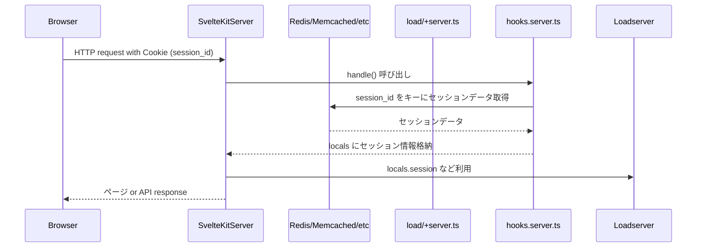

# SvelteKit のセッション管理（サーバーサイドセッション）

**「SvelteKit における JWT ではないセッション管理（= 通常のサーバーサイドセッション）」** について説明します。

## 🔹 1️⃣ そもそも サーバーサイドセッションとは？

**「サーバーサイドセッション」** というのは。

* セッションID（`session_id`）を Cookie に保存（HttpOnly, Secure 推奨）
* サーバー側にセッションデータを保持（例えば Redis などに保存）
* Cookie の `session_id` と Redis などのデータストアを突合して認証する

Express なら `express-session` + `MemoryStore`/`RedisStore` みたいな構成です。

## 🔹 2️⃣ SvelteKit では標準で `express-session` 相当はない

SvelteKit 自身には **`session` ミドルウェアは用意されていません**。
従って、自分で以下の構成を組みます。

### 具体的には：

* `hooks.server.ts` にて Cookie から `session_id` を読む
* `session_id` に基づき Redis などからセッション情報を取得
* `locals` にその情報を格納
* `load` / `+server.ts` などで `locals` を利用する

## 🔹 3️⃣ データフロー図（Mermaid）



## 🔹 4️⃣ 具体的実装例

### `hooks.server.ts` でセッション読み込み

```ts
// src/hooks.server.ts
import type { Handle } from '@sveltejs/kit';
import cookie from 'cookie';  // npm install cookie
import { getSessionData } from '$lib/server/session-store';  // 自作セッション取得関数

export const handle: Handle = async ({ event, resolve }) => {
  const cookies = cookie.parse(event.request.headers.get('cookie') || '');
  const sessionId = cookies.session_id;

  let session = null;
  if (sessionId) {
    session = await getSessionData(sessionId);  // 例えば Redis から取得
  }

  event.locals.session = session;

  return resolve(event);
};
```

### `+layout.server.ts` などで guard 的利用

```ts
import type { LayoutServerLoad } from './$types';
import { redirect } from '@sveltejs/kit';

export const load: LayoutServerLoad = ({ locals, url }) => {
  if (!locals.session) {
    throw redirect(302, `/login?redirectTo=${url.pathname}`);
  }

  return { session: locals.session };
};
```

### セッションデータ保存関数の一例（`$lib/server/session-store.ts`）

```ts
// 例: Redis 接続
import { createClient } from 'redis';

const redis = createClient();
await redis.connect();

export async function getSessionData(sessionId: string) {
  const sessionJson = await redis.get(`sess:${sessionId}`);
  return sessionJson ? JSON.parse(sessionJson) : null;
}

export async function setSessionData(sessionId: string, data: any) {
  await redis.set(`sess:${sessionId}`, JSON.stringify(data), { EX: 60 * 60 * 24 });  // 24時間有効
}
```

## 🔹 5️⃣ まとめ：JWT と比較した設計ポイント

| 項目         | JWT          | サーバーセッション（Redis など）    |
| ---------- | ------------ | ---------------------- |
| ステート       | ステートレス       | ステートフル（状態あり）           |
| スケーラビリティ   | 優秀（状態不要）     | Redis 等必要              |
| セキュリティ     | 長期間有効JWTはリスク | セッションID奪取リスクあり（短寿命が推奨） |
| クライアント保存   | JWT本体        | セッションIDのみ              |
| hooks での実装 | JWT 検証       | セッションIDから DB 取得        |

✅ **結論:**

* **「SvelteKit ではセッション管理がビルトインではなく、`hooks.server.ts` による自作が基本」**
* JWT であろうと、サーバーセッション（ステートフル）であろうと、
  **`hooks.server.ts` → `locals` への格納 → `load` や API で利用**
  が基本パターン。

