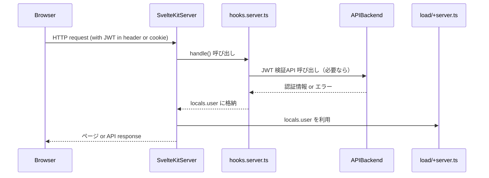

# SvelteKit のセッション管理（JWT）

## 🔹 1️⃣ そもそも SvelteKit のセッション管理とは？

SvelteKit には「Express の `session` のようなビルトインの状態管理」はありません。
**セッション管理の要否・仕組みはアプリケーション側に委ねられている** という思想です。

SvelteKit では通常以下のように扱います。

| 用途       | 実装ポイント                               |
| -------- | ------------------------------------ |
| 状態共有     | `locals`（サーバーリクエストごとの状態）             |
| 認証状態の維持  | Cookie / JWT などで自前実装                 |
| クライアント状態 | `stores`（`$session` などの仕組みはなく、自分で定義） |


## 🔹 2️⃣ JWT ステートレス認証と SvelteKit

**「WebAPI経由サービス」＋「ステートレスJWT認証」** という構成では、SvelteKit 側の考え方はこうなります。

✅ **設計の前提**

* セッション（サーバー側の状態管理）は不要
* JWT によってクライアントとサーバー間で状態を暗黙に維持

✅ **実装ポイント**

* `Authorization: Bearer <JWT>` ヘッダーを使う
* あるいは `HttpOnly` Cookie に JWT を保存し、自動送信させる
* `hooks.server.ts` で `locals` に認証結果を格納
* 各 `load` 関数や `+server.ts`（APIハンドラ）では `locals` を確認


## 🔹 3️⃣ 流れ図（シーケンス）




## 🔹 4️⃣ 具体的な実装例

#### `hooks.server.ts` で JWT 検証（例）

```ts
// src/hooks.server.ts
import type { Handle } from '@sveltejs/kit';
import { verify } from 'jsonwebtoken'; // or jose など好みのライブラリ

const JWT_SECRET = 'your-secret-key';

export const handle: Handle = async ({ event, resolve }) => {
  const authHeader = event.request.headers.get('authorization');
  let user = null;

  if (authHeader && authHeader.startsWith('Bearer ')) {
    const token = authHeader.substring(7);

    try {
      const decoded = verify(token, JWT_SECRET);
      user = decoded;
    } catch (err) {
      console.error('Invalid JWT', err);
    }
  }

  event.locals.user = user;

  return resolve(event);
};
```

この `user` は **全ての `load` / `+server.ts` で `locals.user` として参照可能** です。


#### `+layout.server.ts` で guard 的に使う例

```ts
import type { LayoutServerLoad } from './$types';
import { redirect } from '@sveltejs/kit';

export const load: LayoutServerLoad = ({ locals, url }) => {
  if (!locals.user) {
    throw redirect(302, `/login?redirectTo=${url.pathname}`);
  }

  return { user: locals.user };
};
```


## 🔹 5️⃣ クライアント側 JWT 保管方法の選択肢

✅ **セキュリティ考慮点：**

* `localStorage` は XSS に弱い（推奨されない）
* `HttpOnly` Cookie なら JS から読めないが、XSS には強い
* SPA 的に `fetch` で `Authorization` ヘッダー送信も可（手動管理）


### 🔹 6️⃣ まとめ

| 項目       | 設計指針                                                       |
| -------- | ---------------------------------------------------------- |
| セッション方式  | サーバー状態は不要（ステートレス）                                          |
| 認証手段     | JWT                                                        |
| JWT 保存先  | 推奨は `HttpOnly Secure Cookie`（API 連携時に自動送信）                 |
| 認証処理箇所   | `hooks.server.ts` で JWT 検証 → `locals` に user 格納            |
| 認証ガード    | `+layout.server.ts` / `+page.server.ts` で `locals.user` 判定 |
| API 呼び出し | `fetch` の際 `Authorization` ヘッダーを忘れずに                       |


📝 **あなたの場合は「バックエンドAPI経由」なので、
JWT の検証自体を `hooks.server.ts` で自前で行う or API に問い合わせて `locals.user` に格納する**
というパターンが理想的です。

必要なら **「完全サンプル構成」** を用意できるので遠慮なくどうぞ！ 👍
