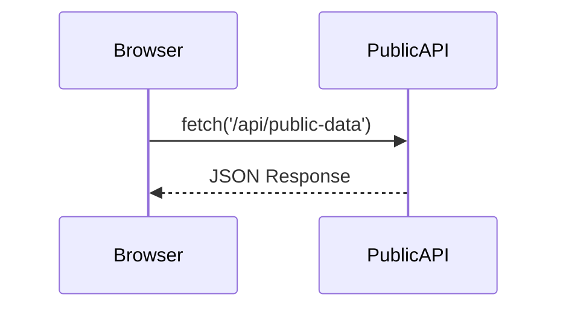
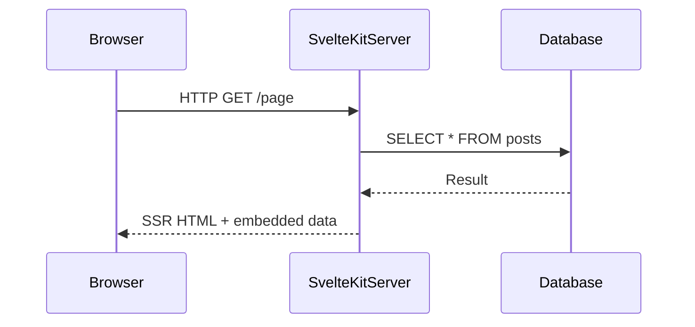
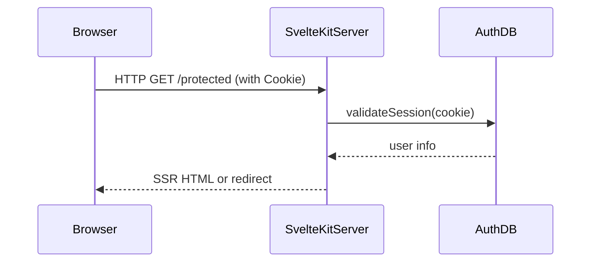
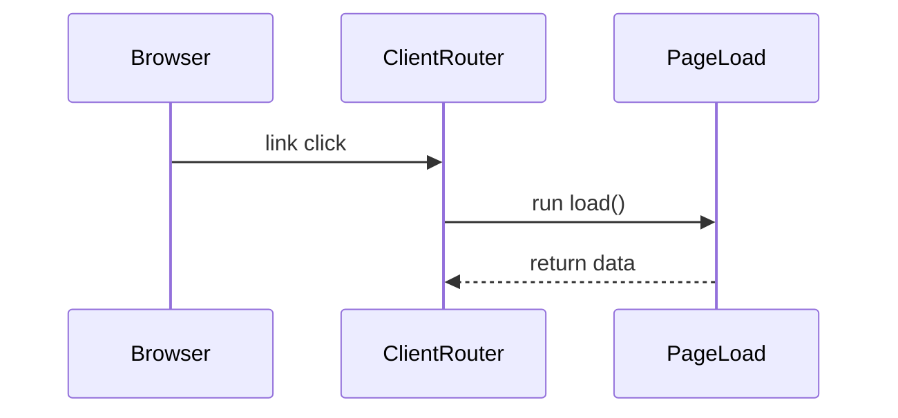
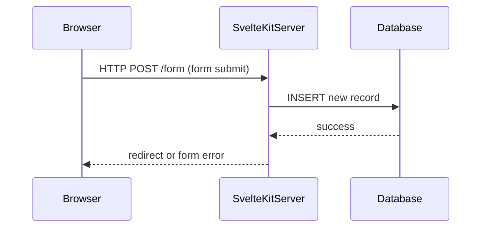
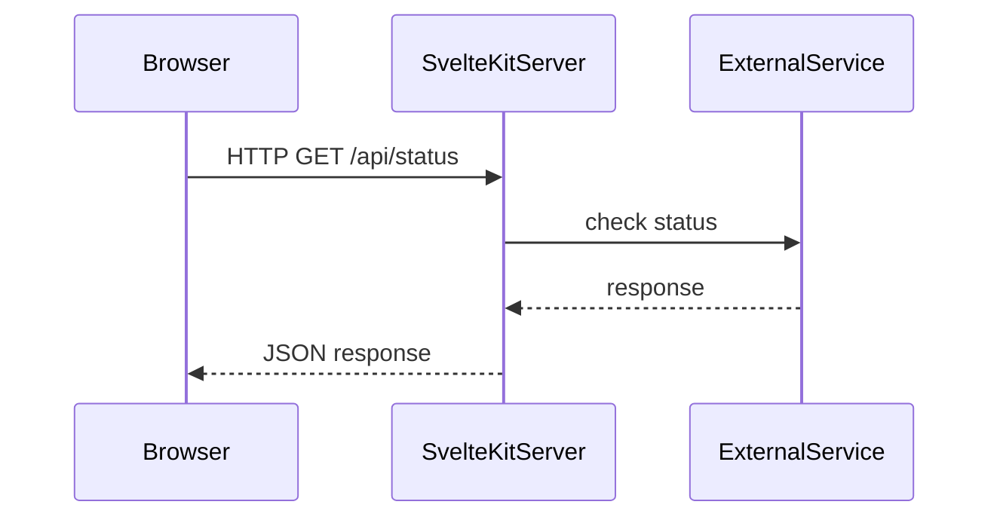

# `+page.ts` と `+page.server.ts` における `load()` 関数の違い

SvelteKit では、`+page.ts` と `+page.server.ts` にそれぞれ `load()` 関数を定義できますが、実行環境や使用目的が異なります。

## 🔍 主な違い

| 項目 | `+page.ts` の `load()` | `+page.server.ts` の `load()` |
|------|------------------------|------------------------------|
| 実行環境 | クライアント / SSR 両対応 | サーバのみ |
| アクセス可能情報 | `page`, `fetch`, `data` など | `params`, `locals`, `request`, `setHeaders` など |
| セキュリティ | 秘密情報を扱うのは NG | 機密データの処理に適する |
| 代表的な用途 | 公開APIフェッチなど | DBアクセス、認証、クッキー処理など |

## ✅ 使用例

### `+page.ts`

```ts
// +page.ts
import type { PageLoad } from './$types';

export const load: PageLoad = async ({ fetch }) => {
  const res = await fetch('/api/public-data');
  const data = await res.json();
  return { data };
};
```

- fetch() は SvelteKit がラップしたバージョン
- クライアント側で動作するため、機密データの取り扱いは避ける

### `+page.server.ts`

```ts
// +page.server.ts
import type { PageServerLoad } from './$types';

export const load: PageServerLoad = async ({ params, locals }) => {
  const user = await locals.db.getUser(params.id);
  return { user };
};
```

- `locals` を使ってサーバー側の情報（DBやセッション）を安全に取得できる

## 🔁 両方の `load()` を併用する場合

- `+page.server.ts` の `load()` は先に実行され、その結果が `+page.ts` の `load()` に `data` 経由で渡される。

```ts
// +page.ts
export const load: PageLoad = async ({ data }) => {
  return { user: data.user };
};
```

## 🌐 HTTP的な違い（リクエスト/レスポンス観点）

| 観点 | `+page.ts` の `load()` | `+page.server.ts` の `load()` |
|------|------------------------|------------------------------|
| 初回アクセス（SSR） | サーバで実行 → HTMLに埋め込み | サーバで実行され、結果が HTML に含まれる |
| クライアント遷移時（SPA） | クライアント側で直接実行される | 実行されない（クライアントからは不可） |
| 外部APIとの通信 | `fetch()` 経由でクライアントが通信 | サーバ内部から直接通信（セキュア） |
| Cookie/セッションの利用 | HttpOnly Cookie は扱えない | `locals` や `request.headers` で取得可能 |
| リクエストヘッダーの扱い | `fetch()` に明示的に設定する必要あり | 自動的に含まれる（サーバ処理の一部として） |

### 💡 実行タイミングの流れ（概略）

```text
[初回アクセス]
→ ブラウザがページ要求（HTTPリクエスト）
→ SvelteKit が `+page.server.ts` の load() を実行
→ 結果を HTML に埋め込む
→ クライアントが `+page.ts` を必要に応じて実行（fetchがあればHTTP通信）

[クライアントナビゲーション]
→ リンククリック等でルーティング発生
→ クライアントが `+page.ts` の load() を直接実行
→ 必要に応じて fetch による API 通信が行われる
```

- このように、HTTP観点で見た場合 `+page.ts` は「クライアント発リクエスト」のトリガーになり、`+page.server.ts` は「SSR時のレスポンス生成」の一部として働く点が大きな違いです。
## 🔐 結論：適切に使い分ける

- クライアントとサーバで役割を分離し、安全性と効率性の高い設計を目指すことが重要です。

# SvelteKit におけるユースケース別シーケンス図集

以下は、`+page.ts` や `+page.server.ts` など、SvelteKit における主な処理フローを **Mermaidシーケンス図** を用いて表現したものです。実装場所ごとの役割を視覚的に整理しています。


## 1. 📡 公開APIフェッチ（クライアント側）

**実装場所：`+page.ts`**




## 2. 🗃 DBアクセス（サーバ側）

**実装場所：`+page.server.ts`**




## 3. 🔐 認証処理（セッション確認）

**実装場所：`hooks.server.ts` + `+layout.server.ts`**




## 4. 🔁 SPA ナビゲーション（クライアント遷移）

**実装場所：`+page.ts`**




## 5. 📝 フォームアクション

**実装場所：`+page.server.ts` の `actions`**




## 6. 🔧 APIルート（REST APIとして）

**実装場所：`src/routes/api/+server.ts`**

